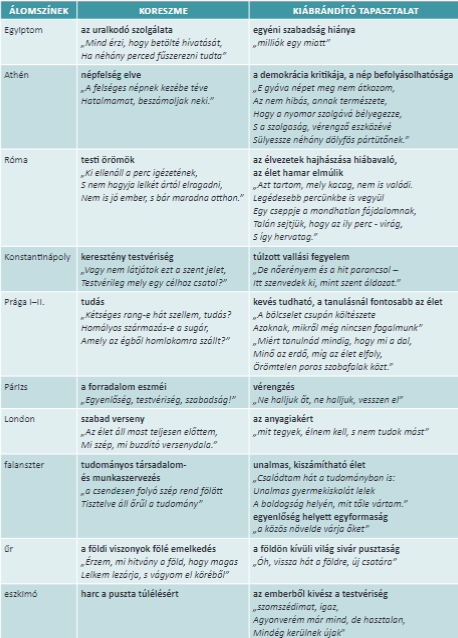

# Realizmus  
1. A XIX. század festészeti, irodalmi irányzata: a realizmus  
	1. A latin "Real" szóból ered, "Valódi", "igaz"  
	2. Célja a valóságra a jelen kor emberének világára mutat rá  
	3. Irodalomban:  
		1. A regény és novella lesz a közkedvelt műfaj  
	4. A világirodalom nagy realistái:  
		- Dosztojevszkij: Bűn és bűnhődés (Orosz)  
		- Tolsztoj: Háború és béke (Orosz)  
		- Balzac: Goriot apó (Francia)  
		- Stendhal: Vörös és Fekete  
		- Nyikolaj Vaszilyevics Gogol: A köpönyeg (Orosz)  
## Gogol  
1. Gogol az orosz realizmus első képviselője, "Mindannyian Gogol köpönyegéből bújtunk elő" - Dosztojevszkij (jelentése: a köpönyeg című elbeszélésére utal, amely a későbbi realistákra nagy hatással volt)  
2. Gogol hivatalnokként és műveinek szereplőivé válnak ezek a "kisemberek", oroszul Csinovnyikok.  
	- Átlagos, hivatalban dolgozó emberek, Gogol mégis izgalmas stílusban tárja fel az orosz kisember külső/belső világát  
	- Mindezt sajátos humorral teszi, főhőse groteszk figura  
		- a Groteszk fogalma a művészetben: ellentétes elemek keverednek benne, egyszerre nevetséges és tragikus, torz is lehet egy ember, társadalmi jelenség  
	- Hf: olvasd el a köpönyeg-et, írj jellemzést a főhősről  
		- Akakij Akakijevics  
			- Egy szerény, jelentéktelen és magányos hivatalnok  
			- Élete, jelleme az orosz kisember típusát testesíti meg  
			- Egyszerűség, Monotónia  
				- Másoló a hivatalban, életének egyetlen értelmeként érzi a másolást  
				- A külvilág számára nem létezik  
			- Alázat  
				- Nem áll ki magáért  
				- Csendben tűri a sértéseket  
			- A köpönyeg  
				- Új köpönyeget kell készíttetnie  
				- Megszerzése valóságos örömöt hoz rá  
				- Reményt adott neki  
				- Számára a boldogság jelképévé alakul  
				- Mikor elvették tőle akkor lebetegedett, majd meghalt  
### A köpönyeg  
1. A mű realizmusa:  
	- Orosz hivatalnokvilág bemutatása egy "kisember" éltén és halálán keresztül  
	- neve: Akakij Akakijevics Basmacskin  
	- Az iratmásoló Akakij életében egy új köpönyeg varratása hoz fordulatot  
	- Az orosz kisember jellemzőit látjuk:  
		- Társadalmi megbecsülése alacsony  
		- Viselkedése kisszerű  
		- Gyakran kigúnyolják  
	- Realista elem a korrupt rendőrhivatal ábrázolása is  
2. Groteszk és Abszurd  
	- Groteszk  
		- Maga a Akakij alakja  
		- Egyszerre szánalmas, nevetséges és tragikus is, esetleg félelmetes  
	- Abszurd  
		- Lehetetlen, valóságon túli  
		- Akakij köpönyegét ellopják, ő meghal, de szelleme kisértetként járja Pétervár utcáit  
		- "Bosszút áll" a tolvajokon és korrupt rendőrfőkapitányon is  
3. Gogol stílusa  
	1. Aprólékos, részletező (realizmus)  
		- A főhős otthona  
		- Sajátos írói stílusa van:  
				- Szórakoztató, "Fecsegő" beszédmód, közvetlenséget teremt, néha meg is szólítja az olvasót  
4. Lev Tolsztoj orosz regényíró  
	1. Híresebb regényei  
		- Háború és béke  
		- Anna Karenina  
		- Ivaniljics halála (kisregény)  
5. Puskin (orosz)  
	- A romantika első alakja  
	- Fő műve: Anyegin (Szerelmes levélregény)  
6. Henrik Ibsen  
	- Norvég drámaíró  
	- Polgári származású  
	- Fő művei  
		- A vadkacsa  
		- Babaszoba  
7. Csehov  
	- Orosz drámaíró, írt prózát is  
	- Műveiben az orosz arisztokrácia problémái (magány, reménytelenség) jelenik meg  
	- Főbb művei:  
		- Sirály  
		- Három nővér  
		- Cseresznyéskert  
	- Drámaiatlan drámáknak is nevezik a műveket  
# Magyar irodalom a 19. Században  
- 1849 utáni helyzet:  
	- 1867 kiegyezés -> Osztrák-Magyar Monarchia  
		- Gazdasági,  
		- Társadalmi,  
		- Kulturális fejlődés  
- Tk. 62-64. o. (el kéne olvasni)  
## Madách Imre  
1. Életrajzi elemek  
	1. Alrosztregován (felvidék) született, középnemesi családba  
	2. Ügyvédi vizsga után 1843ban Nógrád megye másodjegyzője lesz  
	3. Felesége Fráter Erzsébet (elváltak)  
	4. Szabadságharc  
		- Családi tragédiák  
		- Elválik  
		- Kossuth titkárát bújtatta (Jail :< Boowomp, birtokvesztés)  
	5. 1850-es évek -> Bach rendszer szigorú megtorlásai, besúgóhálózatának időszakában készült "Az ember tragédiája"  
	6. 1863 MTA tagja  
	7. Egyéb művei: Kisebb drámai alkotások, pl. "Mózes", "Civilizátor"  
## Az Ember tragédiája  
1. Keletkezése:  
	1. 1859-1860: a mű megírása  
	2. 1861: Arany Jánosnak elküldi a kéziratot  
		- Arany méltatta, csak stilisztikai ajánlatokat adott  
	3. 1862: A mű első kiadása  
	4. 1883: A mű első színházi előadása  
	5. Sok nyelvre lefordították  
	6. 2001: Az új nemzeti színház nyitódarabja volt  
	7. Jankovics Marcell animációs filmje  
2. Műfaji kérdések  
	1. Filozófikus (-> Az élet nagy kérdései) drámai (-> színpadra állítható) költemény (-> verses formájú)  
	2. Emberiségdráma/könyvdráma  
	3. Kétszintes dráma:  
		1. Szellemvilág:  
			- Az úr  
				- Az angyalok kara  
			- Lucifer  
			- Föld szelleme  
		2. Földi világ  
			- Az emberi világ  
3. A mű forrásai; Mit használt fel Madách?  
	1. Biblia:  
		1. Édenkert  
	2. Irodalmi források  
		1. Goethe: Faust  
		2. Vörösmarty Mihály: Csongor és Tünde  
		3. Kölcsey költészete, pl: Vanitatum Vanitas  
	3. Van-e a történelemben fejlődés?  
		1. Hegel német filozófus elméletét építi át a műbe:  
			1. Van fejlődés, spirális vonallal írható le; van iránya a fejlődésnek, de mindig van benne ismétlődés  
			2. A történelmet a nagy eszmék határozzák meg:  
				1. Szabadság  
				2. Egyenlőség  
				3. Testvériség  
				4. Tudomány  
			3. Ezek az eszmék korszakonként váltják egymást; sokszor egymás ellentétei, vagy éppen eszme nélküli időszakok jönnek létre  
			4. (Eszme <-> Antieszme) -> Eszme nélküli állapot, pl. (Egyiptom <-> Athén) -> Róma  
		2. A tudományba vetett emberi hit eszméje (Utilitarizmus - Haszonelvűség elmélete) a Falanszterbe jelenik meg  
		3. A nap kihülésének jóslatát az Eszkimó színbe építi  
		4. Utópisztikus szocializmus, Falanszter elmélete  
4. A tragédia szerkezete  
	1. Keretszínek:  
		- I., II., III. szín  
			- I. szín, Menny  
			- II. szín, Paradicsom  
			- III. szín, Paradicsomon kívül  
		- XV. szín  
			- Paradicsomon kívül  
	2. Történelmi színek  
		- IV. szín, Egyiptom  
		- V. szín, Athén  
		- VI. szín, Róma  
		- VII. szín, Konstantináply  
		- VIII. szín, Prága 1  
		- IX. szín, Párizs, Álom az álomban  
		- X. szín, Prága 2  
		- XI. szín, London (Madách jelenkora)  
	3. Jövő-színek  
		- XII. szín, Falanszter  
		- XIII. szín, Az űr  
		- XIV. szín, Eszkimószín  
5. Keretszínek  
	- Madách alapállása Deista (Isten létezik, ő a teremtő, de nem avatkozik bele a világba)  
	- "Be van fejezve a nagy mű, igen  
	A gép forog, az alkotó pihen"  
	1. Menny  
		- A teremtés pillanata jelenik meg  
		- Az úr, az angyalok kara, Lucifer  
		- Lucifer a tagadás szelleme fellázad az Úr ellen, követeli a maga jussát, részét a teremtett világból  
		- Lucifer a teremtést hibásnak tartja, szerinte minden "csak" anyag a világon, az ember is  
		- A teremtés öncélú volt: az úr önmagát dicsőitetti  
	2. A paradicsom  
		- Az úr bukott angyalként jelöli meg a földet Lucifer számára, ahol célja az lesz, bebizonyítsa a teremtés hibás voltát  
		- Az ember bukását szeretné látni, öngyilkosságba hajszolni  
		- Megtörténik az Édenkertben az ember megkisértése, Lucifer azzal győzi meg Ádámot és Évát, hogy legyenek maguk urai, szabadok, legyenek olyanok, mint isten  
		- A tudás és nagyravágyás a csábítás lényege  
	3. A paradicsomon kívül  
		- Ádám lelkesedik, hogy a tudás birtokában boldogul az életben, Éva visszavágyik az Édenkertbe  
		- Ádám kéri meg Lucifert, hogy mutassa meg a jövőt, Lucifer álmot bocsát rájuk  
### 4.  (Tk. 100)  
4. Egyiptom - Mindenki egyért => Szabadság hiánya  
5. Athén - Népfelség/Demokrácia => Manipuláció  
6. Róma - "eszme", a testi örömök => Az élet örömeinek hajszolása hiábavaló  
7. Konstantinápoly - Keresztény tesztvériség => Eretnekség  
8. Prága - A tudás => A tudás felülírja a pénzszerzés  
9. Párizs - Szabadság, Testvériség, Egyenlőség; álom az álomban => vérengzés, polgárháború tör ki, az eszmék együtt nem valósulhatnak meg  
10. Prága -||-  
11. London - Szabadverseny => Az anyagi javak eltorzítják  
12. Falanszter - Tudományos társadalom és munkaszervezés => Unalmas világ, száműzik ami nem hasznos: érzelmek, költészet, család, stb.  
13. Az űr - Földi viszonyok, az anyag fölé emelkedés => Simán üresség, a Földanya szelleme szólítja vissza Ádámot: a földön kell megküzdenie sorsával  
14. Eszkimó szín - Harc a puszta túlélésért: az ember ösztönlény => Az ember állati létben él  
### 5. Szerepek  
1., 2., 3., 15. Saját szerepeikben vannak  
Ádám - Éva - Lucifer  
4. Egyiptom: Fáraó - Rabszolganő - Fáraó minisztere  
5. Athén: Miltiádész (Hadvezér) - Felesége - Harcos  
6. Róma: Sergiolus (Római Patrícius) - Júlia (Kéjnő) - Milo (Patrícius hedonista)  
7. Konstantinápoly: Tankréd (Lovag) - Izóra (Tankréd szerelme, apáca) - Fegyverhordozója Tankrédnak  
8. Prága 1: Kepler (Császár csillagásza) - Borbála (Kepler felesége) - Famulus (Házi szolgáló)  
9. Párizs: Danton (Forradalmár) - Forradalmár lány / Márkiné - Hóhér  
10. Prága 2: = Prága 1  
11. London: Munkás - Polgárlány - Munkás  
12. Falanszter: Mindhárom falanszter lakók  
13. Az űr: Ádám - 0 - Lucifer  
14. Eszkimó: Eszkimók mindhárman  
### 6. Ádám - Éva - Lucifer jellemzése  
- Ádám és Lucifer együtt értelmezhető:  
	- A bennünk lévő küzdést, jobbra törekvést testesíti meg Ádám  
	- A szintén bennünk lévő kételkedést, tagadást testesíti meg Lucifer  
	- A kettő egymás mellett értelmezhető az emberben  
	- Ádám jelképezi a korszellemet, ő az eszmék hordozója, küzd értük, szükségszerűen csalódik is  
1. Ádám az, aki mindig kérdéseket tesz fel, Lucifer pedig válaszol ezekre  
2. Lucifer:  
	- Neve jelentése: fényhozó (latin Lux szóból, Lux = Fény, Luxus = Fényűző)  
	- Ő a Tagadás szelleme, kételkedése viszont szükségszerű a világ működésében: hideg racionalitása Ádám naivitását egyensúlyozza  
	- Az egyes színekben az adott kor hibáit mutatja fel:  
	- 3 dolog bosszantja:  
		- A szépség  
		- A kereszt  
		- A szerelem  
	- Összegezve: A világban szükséges a rossz (Lucifer)  
3. Éva:  
	- Éva hordozza a nőiség minden fontos jellemzőjét:  
		- Érzelem  
		- Természetesség  
		- Sejtelem, megérzés  
	- Szerepei sokfélék, pozitív és negatív értelemben; + feleség, családanya, szerelmes társa Ádámnak; - Héjhölgy, hűtlen feleség  
	- Mellékszerepei ellenére igai ellenfele Lucifernek, és Ádámot is ő menti meg a végén az öngyilkosságtól: Gyermeket várt  
4. Az Úr:  
	- Bibliai Istennek megfelel:  
		- Teremtő Isten, az édenkerti bűnbeesés, két tiltott fa  
		- Az abszolút jó megtestesítője erkölcsi értelemben  
	- Ami nincs benne a Bibliában az a Menny-jelenet, Lucifer alakja (középkori) és az, hogy Lucifer teret kap a földön  
	- Az XV. színben szólal meg hosszabban, világossá teszi az emberi tudás korlátait  
	- A bűnbeesés ellenére támogatja a szabad akarattal bíró emberpárt, akik végül mellette döntenek Lucifer helyett  
	- A mű utolsó szavai is az Úr szájából valók, "Monottam ember: küzdj, és bízva bízz"  
## Madách dolgozat  
1. Madách életrajzából főbb elemek  
2. Mű keletkezése  
	1. Megírása:1860  
	2. Arany átdolgozása:1861  
	3. Kiadás:1862  
	4. Ősbemutatója (első színházi):1883  
3. Műfaji meghatározások (3 féle):  
	1. Filozofikus Drámai költemény  
	2. Könyvdráma  
	3. Kétszintes dráma  
4. Források, elméletek  
	1. Falanszterelmélet  
	2. Herder nemzeteszme  
	3. Biblia  
	4. Goethe: Faust  
	5. Vörösmarty Mihály: Csongor és Tünde  
	6. Kölcsey költészete  
5. Színek és neveik  
	1. Menny  
	2. Paradicsom  
	3. Paradicsomon kívül  
	4. Egyptom  
	5. Athén  
	6. Róma  
	7. Konstantinápoly  
	9. Prága  
	10. Párizs  
	11. Prága 2  
	12. London  
	13. Falanszter  
	14. Az űr  
	15. Eszkimó szín  
	16. Paradicsomon kívül  
6. Eszmék szerepe (IV-XIV. színekben)  
	1. Milyen eszmék vannak? (Vagy éppen nincsenek) => Miért küzd Ádám, miért csalódik  
7. Ádám-Éva-Lucifer szerepei a történelem és jövő színekben  
	4. Egyiptom: Fáraó - Rabszolganő - Fáraó minisztere  
	5. Athén: Miltiádész (Hadvezér) - Felesége - Harcos  
	6. Róma: Sergiolus (Római Patrícius) - Júlia (Kéjnő) - Milo (Patrícius hedonista)  
	7. Konstantinápoly: Tankréd (Lovag) - Izóra (Tankréd szerelme, apáca) - Fegyverhordozója Tankrédnak  
	8. Prága 1: Kepler (Császár csillagásza) - Borbála (Kepler felesége) - Famulus (Házi szolgáló)  
	9. Párizs: Danton (Forradalmár) - Forradalmár lány / Márkiné - Hóhér  
	10. Prága 2: = Prága 1  
	11. London: Munkás - Polgárlány - Munkás  
	12. Falanszter: Mindhárom falanszter lakók  
	13. Az űr: Ádám - 0 - Lucifer  
	14. Eszkimó: Eszkimók mindhárman  
8. A keresztszínekről röviden  
	1.  
9.  Ádám-Lucifer jellemzése, + Éva, Az úr  
	1.  
10. Miért tekinthető fókuszpontnak a Londoni szín (+1)  
	1. A kapitalizmus, szabadverseny ábrázolása  
	2. Bemutatja a rendszer problémájait  
	3. Minden szellemi dolog árúvá vált  
## Arany János  
### Életrajz  
- Nagyszalontán született (nagyváradhoz közel, Partium)  
- Szegényedett nemesi család, paraszti élet, 8 testvéréből 2 maradt  
- 14 éves korában már segédtanítóként is dolgozott  
- 1833: Debreceni ref. koll. diákja, később Kisújszálláson tanít  
- Vándorszínészként is játszott rövid ideig  
- Első irodalmi sikere a Bolond Istók c. elbeszélő költeménye  
- 1840: Házasárga Ercsey Juliannával  
	- Két gyermekük: Juliska és László, Arany László híres meseíró, mesegyűjtő lett  
- 1846: Az elveszett alkotmány c. művével elnyeri Kisfaludy Társaság pályázatát  
- A Toldi trilógia első részével kiemelt díjat nyert  
- Szabadságharc:  
	- Petőfi barátsága  
	- Nemzetőrként szolgálta a haza ügyét  
	- A szabadságharc bukása után rejtegette Arany Szendrey Júliát és Zoltán fiukat  
- Nagykőrös: 2 évig nem alkot, majd 1853-tól balladákat ír  
#### Nagykőrösi korszak (1853-1859)  
- Gimnáziumi tanár  
- "Önként vonul száműzetésbe"  
- 1860: Visszaköltözik BP-re, a Kisfaludy Társaság igazgatója lett  
#### BP  
- Újságszerkesztő a Koszorú és a Szépirodalmi Figyelő c. irodalmi lapoknál  
- 1865: MTA titkára, majd főtitkára  
- 1877: Közélettől visszavonult, Gyulay Pál egy kapcsoskönyvet ajándékoz számára, ebbe írja az Őszikék c. versciklus balladáit és lírai költeményeit  
- 1882-ben meghal  
### Elbeszélő költeményei  
- Az elveszett alkotmány (1845)  
- Nagyidai cigányok (1850)  
- Bolond Istók (1850-51)  
- Csaba trilógia, melynek első részével, Buda halála c. eposztöredékkel készült el (1863)  
### Költészete a szabadságharc bukása után  
- Negatív fordulatok: {  
	- Petőfi elvesztése  
	- A nemzeti szabadságának reménye elvész } => Költői válság  
		- Két évig nem ír verset  
- Néhány verse az 1850es évek elejéről,  
	- Letészem a lantot  
	- Kertben  
	- Ősszel  
### Letészem a lantot (Szgy. 150.)  
- Műfaja: Elégiko-Óda  
	- Elégia (Szomorúság, lelki fájdalom) + Óda (Dicsőítés, ünnepélyes hangnem)  
- Időszembesítő vers:  
	- A múlthoz pozitív értékek kötődnek  
		- Fiatalkori költészete  
		- Petőfi barátsága  
		- Reformkori küzdelmek  
- Értékszembesítő vers  
	- A múlthoz pozitív értékeket társít a költő, pl.:  
		- Saját fiatalkorának költői sikerei  
		- A reformkor küzdelmei  
		- Petőfi barátsága  
	- A jelenhez kapcsolódik  
		- Az alkotói, magánéleti válság  
		- Szabadság reményének elvesztése  
- Refrén  
	- 6 vsz.-on keresztül egy kérdőmondatot ismétel ("Hová lettél, hová levél; Oh lelkem ifjusága")  
	- A 7. vsz.-ban a kérdés állítássá változik ("Oda vagy, érzem oda vagy; Oh lelkem ifjusága")  
	- "Lelkem ifjusága" - Metafora  
### Arany Balladaköltészete - A walesi bárdok  
- Ballada műfaja  
	- A ballada kevert műfaj: három műnem jellemzőit foglalja magába: Líra, Dráma, Epika  
	> "**A BALLADA NEM MÁS, MINT TRAGÉDIA (dráma) DALBAN (Líra) ELBESZÉLVE (Epika)**" - Trefort Ágoston  
	- Két fajtája van  
		- Középkori ballada (Francia szóból ered, "haláltánc")  
		- Francois Villon balladatípusa  
		- Újkori balladatípus  
		- Műballadák (szerzője ismert)  
		- XIX. Században terjed el Európában  
	- A romantika kedvelt műfaja  
	- A ballada jellemzői  
		- Cselekménye sűrített, töredékes  
		- Balladai homály: Ki nem mondott jelenetek, titokban maradt részletek (Az olvasó fantáziájára is szükség van)  
		- Párbeszédes jelenetek  
		- Nyelvezete is tömör, költői képekben gazdag  
		- Lírai monológiok is jellemzik  
### Arany balladatípusai  
1. Két alkotói korszakában ír balladákat  
	1. Nagykőrösi balladák, 1853-59 - Példák:  
		- Ágnes asszony  
		- A Walesi bárdok  
		- V. László  
		- Szondi két apródja  
	2. Kései balladák, melyek egy kötetben, az Őszikék versciklusban találhatóak, 1870es évek második felétől - Példák:  
		- Híd-avatás  
		- Tengeri hántás  
		- Vörös Rébék  
2. Téma szerinti csoportosítás  
	1. Történelmi balladák:  
		- V. László  
		- A Walesi bárdok  
	2. Lélektani balladák:  
		- Ágnes asszony  
		- Tetemre hívás  
	3. Népies témájú  
		- Tengeri-Hántás  
	4. Nagyvárosi téma  
		- Híd-avatás  
3. A balladák szerkezeti jellemzőik  
	1. Lineáris (egyenes vonalú) időkezelés, A -> B pontba halad a történet  
		- A walesi bárdok  
	2. Párhuzamos időkezelés  
		- Szondi két apródja  
	3. Körkörös szerkezetű (A helyszín visszatér)  
		- Ágnes asszony  
### Arany János - Ágnes asszony (szgy. 135. o.) (elemzésvázlat)  
1. Keletkezése és típusa  
	1. Nagykőrösi korszak (1853)  
	2. Lélektani ballada: tárgy a bűn és bűnhődés motívuma  
	3. Szerkezetileg körkörös (a helyszín visszatér)  
2. Szerkezete  
	1. 26 vsz  
	2. Részek:  
		1. Patak partja (1-4)  
		2. Börtön (5-9)  
		3. Tárgyalóterem (10-19)  
		4. Patak partja (20-26)  
	3. Időtartamok  
		1. Patak partja (1) - Néhány óra  
		2. Börtön - Több nap  
		3. Tárgyalóterem - egy-két óra  
		4. Patak partja (2) - Élete végéig  
3. Műfaji jellemzők  
	1. Líra  
		- Verses formájú  
		- 5 soros versszakok  
		- Rímeltetése  
			- XAXAX (félrím)  
			- Zavartságot tükröz  
			- Ágnes "félig megőrült" lelkiállapotához igazodik  
		- Gazdag költői képekben  
		- Nyelvezete tömör  
		- Balladai homály  
			- Gyilkosság részletei  
			- A időtartam csak sejthető  
	2. Dráma  
		- Tragikus történet  
			- Gyilkosság  
			- Ágnes sorsa (megőrülés)  
	3. Epika  
		- Történetet mond el, de a belső történéseken van a hangsúly, azokon, amik Ágnes lelkében és fejében zajlanak  
		- Kihagyásokkal felfűzött *jeleneteket* látunk  
4. A vers fókuszpontja, a 15. vsz., ahol Ágnes összeomlik és bűntudata zokogásba fullad -> A bűnbánatot fejezi ki  
	> Liliomról pergő harmat  
	> Hulló vizgyöngy hattyu tollán.  
	- Liliom = Tisztaság, ártatlanság  
	- Hattyú = Szépség, tisztaság, elegancia  
	- Összességében az isteni megbocsátás adhat még Ágnesnek vígasztalást  
	> "Oh! irgalom atyja, ne hagyj el."  
5. Refrén szerepe  
	> "Oh! irgalom atyja, ne hagyj el."  
	1. Mondhatja maga Ágnes, hiszen számára szükséges az Isten kegyelme  
	2. Mondhatja az elbeszélő költő, aki szánja Ágnest  
	3. Mondhatják a bírák is  
	> "... Isten adjon erőt ahhoz és kegyelmet"  
	4. Verselése  
		- Rímelése: XAXAX  
		- A rímtelen sorok feszültség teremtő erejűek  
		- A versszakok első 4 sora ütemhangsúlyos; 2 üteműek a sorok, 8 szótagosak (4/4)  
		- A refrén időmértékes verselésű; --UU-UU-U  
			- A ritmust a hosszú és rövid szótagok szabályos váltakozása adja  
### Arany János - V. László  
- Nagykőrösi ballada, 1853  
- Témája: Hunyadi László elárulása kapcsán az uralkodó esküszegése  
- Párhuzamos (kétszólamú) szerkesztésű ballada  
	- 1. Szólam: Elbeszélő töredékes közlése az eseményekről  
	- 2. Szólam (az idézőjeles versszakok): a Király és közvetlen emberének párbeszéde  
### Arany János - Szondi két apródja  
- Nagykőrösi b.  
- Téma: Szondi György két apródjáról/fegyverhordó lantos énekeséről szól => a hűség mintaképei!  
- Kétszólamú  
	- 1. sz.: Ali követe kéri a két apródot, hogy a győztest dicsőítsék  
	- 2. sz.: a lantos apródok elmesélik uruk dicső tetteit és halálát  
### Arany János Kései balladái - az Őszikék versciklus balladái  
- Az Őszikék kötet keletkezése  
	1. 1877, Gyulai Páltól kapott kapcsos könyvbe kezdi írni verseit, nyugdíjba vonulása után (Főleg a Margit-szigeten)  
	2.  
		- Ősszel kezdte írni  
		- Elmúlás, összegzés, számadás  
		- Van egy ilyen virág is  
	3. A kötetben a balladák mellett líra művek is vannak  
	4. Balladák:  
		- Vörös Rébék  
		- Híd-avatás  
		- Tetemre hívás  
#### Vörös Rébék  
- Szgy. 138. o.  
- Tk. 86-88. o.  
#### Híd-avatás  
- Öngyilkosság  
## Novella műfaja  
1. A szó francia eredetű: nouvelle = újdonság  
2. Kisepikai műfaj:  
	- **rövid** terjedelmű  
	- kevés szereplő  
	- általában **1 főszereplő**  
	- **rövid idő alatt zajlik** a **cselekménye**  
	- A novellák **váratlan fordulattal, csattanóval** végződnek  
3. Létezett a műfaj a reneszánszban is (Boccaccio: Dekameron), viszont csak a **19. században** terjedt el. A romantika és realizmus stílusirányzatának idején lesz népszerű, pl. Jókai (romantika), Mikszáth Kálmán (romantika ÉS realizmus egyszerre)  
4. Novellatípusok  
	1. Lélektani novellák (mai szóval pszihológiai) mélységű  
	2. Népies / városi témájú  
	3. Egyperces novellák (Örkény István)  
5. A klasszikus novellák felépítése (pl. tragédiák)  
	1. Előkészítés: Expozíció  
	2. Bonyodalom  
	3. Kibontakozás  
	4. Tetőpont  
	5. Végkifejlet  
6. Az elbeszélő/narrátor nézőpontjai  
	1. Az E/3 személyű történetmesélés	  
		pl. a realista regények/novellák egy része: az eseményeket, a szereplőket tárgyilagosan, külső nézőpontból látjuk  
	2. Szubjektív nézőpont, amikor az író által belehelyezkedünk a szereplő helyzetébe  
		pl. "halljuk" a gondolatait, érzelmileg azonosulunk vele  
## Mikszáth Kálmán (1847-1910)  
### Élete, Pályája  
1. Született: Palócföldön, Szklabonyán  
	1. Palócok Felvidéken és a mai M.O.-n, pl. Nógrád, Heves megyében élő magyar népcsoport  
	2. Pesti jogot tanult  
	3. 1871: Mauks Ilonát feleségül veszi, elválnak, majd újra összeházasodnak  
	4. Írói, újságírói sikerek az 1880as években  
	5. Politikai szerepet is vállalt: Szabadelvű Pártban Képviselő  
	6. Írt országgyűlési tudósításokat is  
### Novellás kötetei  
- A tót atyafiak  
- A jó palócok  
1. Keletkezésük: 1882, meghozzák az írói sikert  
2. Mikszáth újszerű parasztábrázolása  
	1. A palóc *paraszti* és *pásztor*társadalom világát jelenítik meg a novellák  
	2. Mikszáth egyszerre realista, romantikus és modern eszközökkel ismerteti meg a palócok világát  
	3. A világ idilli, kerek, egész, de fenyegetve van kívülről  
3. Mikszáth írói stílusa  
	1. Alkalmazza az anekdota "műfaját"  
		- Önálló kis történetek a főtörténeten belül  
		- Színesítik, gazdagítják a művet  
		- Anekdotázik = jó kedvvel mesél  
	2. Lélektanilag is belelátunk a szereplők magatartásába (Realista vonás)  
	3. A nézőpontok váltakozása modern írói eszköz  
	4. Idilli világ és a szimpátia a szereplők felé romantikus jegy  
	5. Alkalmazza a balladisztikus elbeszélést: kihagyások, drámaiság  
	6. A párbeszédek, belső monológok tömörek, de lényegretörőek  
	7. A táj, a természet fontos jelentéssel bír, gyakran megszólalnak a táj elemei, véleményt sugallnak, szereplővé válnak  
4. A tót atyafiak  
	1. 4 hosszabb novellát tartalmaz  
	2. szereplői a pásztorvilágból valók, pl.: A fekete folt c.  

A jó palócok:  
- A bágyi csoda  
- Szegény Gélyi János lovai  
