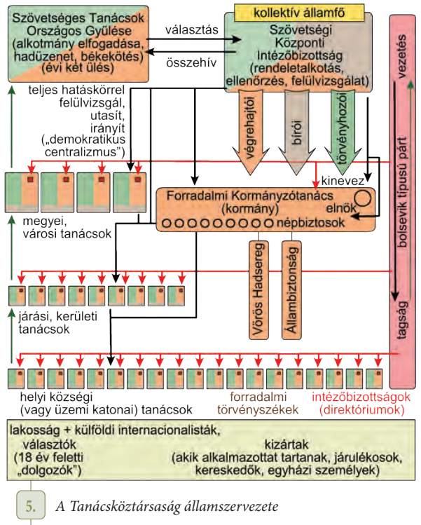

# 1. V.H.  
## Előzmény  
- Gavrilo Princip  
	- Az OMM annektálta Bosznia-Herczegovinát (1908)  
	- **1914. Június 28.**  
	- Ferenc Ferdinánd katonai hadgyakorlatos felvonulást tartott  
		- Ezt a Nacionalisták a területen provokációnak tartották  
	- Szarajevóban Gavrilo, egy Szerb nacionalista megölte Ferdinándot és feleségét  
		- "Egyesülés vagy Halál", más néven "Fekete kéz" terrorszervezet állt a merénylet mögött  
		- a "Fekete kéz"-től kaptak fegyvereket  
		- Ez volt a szikra ami elindította a háborút  
- A merényletre az Osztrák politikusok háborúval akartak válaszolni  
	- Tisza István ezt ellenezte eleinte, végül viszont beleegyezett  
	- Meggyőződött arról, hogy II. Vilmos támogatja a Monarchiát  
		- A németek harcra buzdították a Monarchiát, a fegyverkezési verseny állásából úgy látták, 1914ben nagyobb a nyereségre az esély  
	- A Monarchia kemény diplomáciai jegyzékeket (Ultimátum) küldött Szerbiának  
		- Orosz támogatásban bíztak  
		- Visszautasították a szerbek  
	- **1914. Július 28.** - A Monarchia hadat üzent Szerbiának - A kitörés dátuma  
	- A többi Nagyhatalom is alkalmasnak találta az időpontot céljaik megvalósítására  
	- Pár nap múlva szinte egész Európa hadban állt  
		- Antant részéről:  
			1. Oroszország  
			2. Franciaország  
			3. Nagy-Brittania  
		- A Központi hatalmak részéről:  
			1. Németország  
			2. Osztrák-Magyar Monarchia  
			3. Oszmán Birodalom  
	- Kitört a hábórú ezzel  
## A merénylet  
- Figyelmeztetések ellenére Ferenc Ferdinánd elment Szarajevóba, megnézni a katonai hadgyakorlatot  
- Már korábban merényletet terveztek a Szerb nacionalisták  
	- Ezt elősegítette, hogy a sajtó miatt Ferdinánd útvonala, időpontja köztudott volt  
- Első sikertelen merénylet  
	- 10:10, Nedeljko Čabrinović  
		- Megkérdezte a közelben tartózkodó rendőrtől, melyik kocsi a trónörököst szállító kocsi  
		- A választ követően egy "Kragejuvac" kézigránátot hajlított a jármű felé  
		- A sofőr viszont gázt adott a kocsinak, a gránát a tetővászonra esett  
		- A tetővászonról lepattant, az oszlop 4. kocsija alatt robbant fel  
		- Čabrinović a folyóba ugorva próbált elmenekülni  
				- Elfogták  
			- A méreg, amivel végezni akart magával az csak hánytatta  
	- Ez után az útvonalat megváltoztatták  
		- A sofőrök tévedésből az eredeti útvonalat követték  
- A táborszernagy rászólt a sofőrre, hogy rossz útvonalon halad  
	- A sofőr pont a sarkon lefékezte a kocsit  
	- Gavrilo Princip pár lépésre volt innen  
		- Előhűzta fegyverét, elsütötte  
## A háború  
### Kirobbanás  
#### Hogyan fogadták az emberek a kitörő háborút?  
- Az emberek ünnepelték a háború kitörését  
	- Londonban  
	- Párizsban  
- Arra számítottak, hogy a háború pár hónapon belül **gyorsan** véget ér, győzelmükkel  
#### Mi az a Schlieffen-terv?  
- Háborús terv  
- XX. Század elején elkészítették  
- A németek ki akarták használni a fegyverkezésben elért fölényüket  
- A terv:  
	- Belgiumon át lerohanják Franciaországot (Blitzkrieg)  
	- Oroszok előrenyomulását az OMM feltartóztatja  
	- A Franciák legyőzése után a németek keletre csoportosítják erőjüket (csak lett volna)  
	- OMM-el győzelmet aratnak ott is  
- Célja: Kétfrontos háború elkerülése  
- A terv lassú orosz mozgósítással, gyenge orosz- és erős OMM hadsereggel számolt  
- Feltételezte, hogy a Britek távol maradnak a háborútól  
#### Az I. VH sajátosságai  
- Lövészárok  
- Lövészárok + Gépfegyver = Állóháború  
- Fronton zajlik  
- Szögesdrót  
- 1916, Some folyó menti csatába, Tankokat bevetették  
- Mortar  
- Lángszóró  
- Kézigránát  
- Repülők  
- Tengeralattjárók  
- Első vegyifegyveres hadviselés  
- Sorozott katonaság  
#### Összegzés  
Korlátlan tengeralattjáró háború  
Gorlicei áttörés (1915)  
Az antant meggyőzte az olaszokat  
Bruszilov offenzíva  
	Erőteljes orosz támadás  
1917. Románia belép Antant oldalán  
brutálisan legyőztük őket  
Ferenc József meghalt -> IV. Károly (Utolsó magyar király)  
1917. Oroszország, felkelők leváltják a Cári családot -> Kerenszkij offenzíva, kudarc  
**1917. November Nagy októberi szocialista forradalom**, kivégzik az egész Orosz cári családot  
1918. Breszt-Litovszki béke  
1915. Kilőtték a Lusitania gőzöst  
1917. USA belép  
1918. Véget ér a háború  
## Esszéírás  
### Mutasd be a WWI sajátosságait (Tk. 82, 16. ábra)  
#### Pontok kigyűjtése  
- 1914-1918  
- Helyszínek: Nyugati front, Keleti front, harmadik (Olasz-Monarchia határi) front  
- Csataterek  
	- Verdun  
	- Some folyó  
	- Tannenberg  
- Besorozás  
- Állóháború  
- Lövészárok  
- Hadigazdálkodás  
- Tank  
- Utánpótlás  
- Vadászrepülő, bombázó, felderítő  
- Mustárgáz  
- Géppuska  
- Tengeralattjáró  
- Schliffen terv  
- Lángszóró  
- Szögesdrót  
- Gázmaszk  
- Front  
- Aknamező  
- Senkiföldje  
- Torpedó  
- Hadifoglyok  
- Hadigazdálkodás  
- Hátország (Utánpótlás)  
- Jegyrendszer  

Forráselemzés  
	Ekkor kezdték el használni a géppuskákat csatában, ezért a lövészárkok és géppuska keveréke állóháborút alakított ki a frontokon.  
  
	A frontvonalakon elkezdték a háború második felében használni a tankokat, melyek képesek voltak áthatolni a szögesdróton, ami védte a lövészárkokat, és fedezéket nyújtott a gyalogság részére, miközben haladtak előre, ez felgyorsította az eseményeket a háborúban.  

Kulcs szempontok  
- Technikai újdonságok  
- Besorozás  
Hf: Esszéírás  
[**Esszé** (14 sor (Times new roman, 11es betűméret))](doga/wwi_essze.docx)  
### Doga kérdések  
- Miért lépett be az USA a háborúba (1917)  
	- Kölcsönbérleti szerződés (hitel)  
	- Casus Belli kellett -> Luisitaniai gőzös elsüllyesztése (1915) / Mexikót bíztatták a németek, hogy támadják az USA-t meg, az USA elkapta a levelet  
- Breszlitovszki béke (1918)  
	- Oroszok kiszállnak a háborúból  
	- Polgárháború yippee  
- Miért veszettek a németek  
	- Emberhátrány az USA miatt  
	- Utánpótlási problémák a Tengeri blokád miatt  
- Esszéírás  
## Kisérettségi  
- Egy nap max 1 témakört tanulni  
- Témák  
	1. Ókor  
		1. Athéni államszervezet működése a demokrácia virágkorában  
			- Görög-Római építészet (Majd 12.ben)  
		2. Vallások (Csak Kereszténység jelenleg)  
	2. Középkor  
		1. Iszlám világ  
		2.  
			- Parasztság világa  
			- Polgárság világa  
			- (Városok, céhek, társadalmi beosztás, kereskedelem)  
		3.  
			- Középkori egyház  
			- Román, Gótikus, Reneszánsz építészet  
		4.  
			- Honfoglalás  
			- Kalandozások kora  
		5.  
			- Géza és István  
			- Aranybulla  
			- IV. Béla és a tatárjárás  
		6.  
			- Károly Róbert  
			- Hunyadi Mátyás  
	3. Újkor  
		1. Nagy földrajzi felfedezések  
		2. Reformáció és a Katolikus megújulás  
		3.  
			- Mohács  
			- Kettészakadás  
			- Három részre szakadás  
			- Erdély (Majd 12.ben)  
			- Rákóczi szabadságharc  
		4.  
			- Újranépesedés (Majd 12.)  
			- Brit alkotmányos rendszere és az USA (Majd 12.)  
			- Felvilágosodás (Majd 12.)  
			- II. József és Mária Terézia  
		5. Nemzeti eszmék  
		6. Ipari forradalom (Majd 12.)  
			7. Reformkor  
			8. Forradalom és szabadságharc  
			9. Polgári állam, nagyhatalmi törekvések (Majd 12.)  
		10. Dualizmus kora  
		11. Első VH  
## Magyarország az Első VHban  
1. 1914-1918  
2. A szarajevói merényletre válaszként az Osztrák politikusok többsége szerbiát meg akarta büntetni, Tisza István (A magyar miniszterelnök) viszont nem akart a háborúba lépni, csak akkor lépett be, miután meggyőződött, hogy a Németek a Monarchia mellett állnak  
3. Miután felderült, hogy a szerb közegek is részt vettek a merényletben, a Monarchia ultimátuma megkövetelte, hogy Szerbia hagyjon fel a Monarchia elleni akciókkal  

1. A monarchia hadserege nem volt még modernizálva  
2. Hadat üzentünk, mivel nem fogadta Szerbia el az Ultimátumot  
3. HF: Ki az a Hötzendorf? (94.)  
	1. Régi osztrák hivatalnok, katonacsalád gyermeke  
	2. 1852-1925  
	3. Részt vett az 1878-79es boszniai okkupációban  
	4. 1906ban Ferenc Ferdinánd támogatásával ő lett az OMM vezérkarának főnöke  
	5. A Szerbia és Olaszország elleni megelőző háborúról való kijelentései miatt szembekerült a külügyminisztériummal  
	6. Többször javasolta a Szerbia elleni háborút (1906,1908,1913(x2),1914)  
	7. 1911-ben ideiglenesen le lett mozdítva az uralkodó által a pozíciójáról, de a balkán háborúk idején visszanyerte  
	8. A magyarokat háttérbe akarta szorítani a birodalmi politikában  
	9. A háború kitörésekor az érvei nagyon hatottak az uralkodóra és Tiszára (szemeiben a monarchia legfontosabb politikusa)  
4. Hogyan fogadták a magyarok a háború kitörését?  
	1. Örültek, gyors háborúra számítottak  
5. Kigyűjteni a számokat, adatokat  
	1. 1906,1908,1913 (x2),1914 Szerbia elleni háború ellen javaslat  
	2. 1914 Nov-Dec.: Limanowai csata  
	3. Monarchia összlétszáma: 52M  
	4. Monarchia Mozgósított katonák: 9M  
		1. Ebből Magyar: 3.8M  
	5. Magyar áldozatok:  
		1. Halott: 661k  
		2. Sebesült: 743k  
		3. Hadifoglyok: 734k  
6. Két fronton harcoltunk  
	1. Keleti front  
	2. Olasz front  
		1. Doberdó  
		2. Isonzó  
		3. Piave  
7. Limanowai csata  
	1. Német segítség nélkül megállítottuk az orosz "gőzhengert"  
	2. 1914 November-December  
	3. Nagy véráldozatba került  
	4. Megnézni youtuben  
8. HF: Gorlicei áttörés  
	1. 1915 Május, Galícia  
	2. OMM-Német szövetséges csapatok áttörtek az orosz fronton  
	3. Abban hittek, nem lépnek be az olaszok az Antant oldalán (végül diplomáciai küzdelmekből az Antant lett győzelmes, mivel nem volt nehéz ígérni Monarchiai területeket az olaszoknak)  
	4. Olaszország belépett a háborúba, a katonákat két frontra kellett osztani  
9. Bolgár + Német segítséggel Romániát  
10. 1917, OMM áttöri az Olasz frontot, Velencénél állítottak meg minket a Francia és Angol seregek  
11. Kimerült a hátország  
	1. Életkörülmények romlanak  
	2. Jegyrendszert bevezetik  
	3. Tiszát fogják hibáztatni  
	4. Háború elleni tüntetések  
12. Hogyan veszítettünk?  
	1. I. Ferenc József halála után trónra lépő IV. Károly békekísérletei kudarcba fulladtak  
	2. Leváltotta miniszterelnökségről Tiszát 1917ben, nem tudtak más utat kijelölni a politikának  
	3. Breszt-Litovszki béke  
		1. 1918 Március 3.  
		2. Orosz-OMM béke  
	4. Bukaresti béke  
		1. 1918 Május 7.  
		2. Románia-OMM béke  
	5. A Központi hatalmak hátországai a teherbíró képességük végéhez közeledtek  
	6. Az uralkodó érezte, hogy a birodalom felbomlása közeledik  
	7. Kísérletet tett a belső felbomlás megállítására, Kiáltványt adott ki  
		2. 1918 Október 16.  
		3. Ausztriát föderatív alapon kívánta újjászervezni, M.O.-t nem  
		4. A nemzetiségek az Antant támogatásával többet akartak  
		5. Ez csak felgyorsította a szétomlást, mivel túl késő volt  
	8. Nemzeti tanácsok létrejöttek  
	9. A birodalom nem lépett fel ezek ellen, nem akartak belső konfliktust  
	10. A front teljesen felbomlott  
	11. Fegyvert letettük, **1918 November 3.**, Padova  
	12. A Monarchia szétesik  
13. A franciák tevékenykedtek  
	1. Nem akartak nagyhatalmakat a németek oldalán  
	2. Bolshevizmus megállítása  
	3. Őszi Rózsás forradalom  
# A világháború után  
## Őszi rózsás forradalom  
### Mit akartak az emberek?  
- Megélhetés  
- Föld  
- Szabadságjogok kiterjesztése  
	- Pl. Választójog  
- Háborút elvesztő vezetés lecserélése, akik a vágyakat teljesítik  
	- Októberben (24-e) BP-n megalakul a Magyar Nemzeti Tanács, a Károlyi Mihály által vezetett Függetlenségi és 48-as Párt; Jászi Oszkár által vezetett Országos Polgári Radikális Párt és Szociáldemokraták részvételével (a.k.a. Ellenzéki pártok)  
		- Az elkövetkező napokban sok párt, szervezet és egyén csatlakozott  
	- Károlyi Mihályt ki akarja a nép nevezni PM-nek  
### Mi az az Őszi rózsás forradalom  
- Károlyi Mihály elutasítja a kinevezést  
- Október 30-31 Éjszaka  
	- Az újjonnan alakult Katonatanács utasítására a katonák elfoglalták BP kulcsfontosságú pontjait, a hatalom nem állt ellen  
	- Reggelre győzött a forradalom  
		- Nevét onnan kapta, hogy a katonák Őszirózsát tűztek a sapkarózsa helyére  
	- Okt. 31 reggel az uralkodó nevében ki nevezte József főherceg (M.O. helytartója) Károlyi Mihályt miniszterelnöknek  
### Károlyi Kormány belpolitika alapján: Mi valósult meg a tömeg követeléséből, és ha igen, akkor hogyan?  
- Köztársaságot kikiáltották (1918.Nov.16.)  
- Polgári szabadságjogok kiterjesztése  
	- Bevezették az általános, a nőkre kiterjedő választójogot  
		- Férfiak 21+, Nők 24+  
		- Nem került sor a választásokra  
	- Régi törvényhozás feloszlott, de nem jött új létre  
- A kormány igyekezett a Nemzeti Tanácsra mint Törvényhozó testre támaszkodni  
	- Nem felelt meg a klasszikus demokratikus rendszernek  
- Jegyrendszer megszüntetése  
	- Tovább romlott az ellátás helyzete  
- 1919 Februárjában kiadott, földosztásról szóló törvénynek nem tudtott Károlyi érvényt szerezni  
	- 500+ hold nagybirtokokból, vagy 200+ hold egyházi birtokokból a parasztoknak 5-20 hold földet adott volna a parasztoknak  
	- Csak Károlyi meg a radikálisok támogatták  
	- Csak Károlyi osztott földet, senki mást nem tudott rávenni  
### Károlyi Kormány külpolitikája: Hogyan kezelte a külpolitikai válságot?  
- Az Antant elvárásainak megfelelő politika  
- A nemzetiségeknek nyújtó autonómia  
- Remélte, hogy megvalósulnak a Wilsoni tervek  
- A problémák evvel a politikával?  
	- Nem valósult meg Wilstoni terv  
	- A franciák találták ki a dolgokat  
### Mit tett Károlyi Mihály a hadsereggel?  
- A kormány tartott a katonáktól, tisztektől  
- Szétesett egy 800k főből álló sereg  
	- Hadsereg nélkül maradtunk  
- A MOVE (Magyar Országos Véderő Egylet, Szélsőjobboldali katonai csoport) delegáció próbálta felajánlani szolgálatait  
- Pacifista-Szocialista politikát folytatott  
## Mi történt Belgrádban  
- Károlyi Belgrádba utazott, tárgyalásra  
	- Bízott az Antant jóindulatában  
- A tárgyaláson kiderült, hogy Károlyi és a kialakuló magyar demokratikus állam  
- Fegyverszünetet aláírták (1918. November 13.)  
	- Ez után megszálltak az antanterők  
	- A szerbek és románok benyomultak a kijelölt területükre  
	- Károlyi nem reagált, még mindig hitt az Antantba  
		- Az Antant nem értékelte Károlyi Demokratikus politikáját  
## HF: Felvidéki történések; 1918. December 1-2.  
### Felvidéki történések  
- 1918. December 23. - Ideiglenes határok Csehszlovákia létrehozásához  
- Csehszlovákok elfoglalták a felvidéket  
	- 1918. December 29. - Kassa  
	- 1918. December 30. - Pozsony  
### 1918. December 1-2.  
- Gyulafehérvár, Román nemzeti gyűlés  
- Kimondták Erdély és a Román Királyság egyesülését  
- Károlyi nem értett egyet, nem tudta megakadályozni  
## Tanácsköztársaság  
### Bevezetés  
#### Mi az a KMP?  
- **"Kommunisták Magyarországi Pártja"**  
- 1918. November 24.  
- Kun Béla vezetője  
	- Hadifogságból visszajött kommunista (agymosás volt)  
- A világforradalom katonáinak tekintették magukat  
- Céljuk: Proletárforradalom kirobbantása, proletárdiktatúra bevezetése  
- Szovjet-Orosz pénzügyi támogatással mindent megtettek céluk érdekében  
#### Hogyan próbálták átvenni a hatalmat?  
- Propagandát alkalmaztak  
	- A hatalom megragadására volt  
	- Hibák bírálatára épült  
	- Megvalósítást lehetetlen javaslatokkal tervezték megoldani  
#### Hogyan veszi át a hatalmat?  
- Antant több terület átadását követelték (Vix-jegyzék)  
	- Semleges zónát akarnak kialakítani Románia és M.O. között  
	- Szeged - Debrecen  
- A követelést a kormány nem akarta teljesíteni, lemondott  
- Károlyi is elfogadhatatlan tartotta  
	- A kormányzást csak a szociáldemokraták vállalhatják => Kinevez szociáldemokrata kormányt  
	- A szociáldemokraták nem merték egyedül vállalni a kormányzást, Károlyi tudta nélkül kiegyeztek a KMP vezetőivel  
	- A két párt kommunista programmal egyesült (Magyarországi Szocialista Párt)  
- **1919. Március 21.** - Az új kormány hatalomra került  
	- Proletárdiktatúra bevezetése  
	- Károlyi tudomásul vette, lemondott  
- Károlyi nevében megfogalmaztak egy cikket, hogy lemondott  
### HF: Hogyan működött a Tanácsköztársaság rendszere?; Miért volt eleinte népszerű?  
#### Hogyan működött a Tanácsköztársaság rendszere?  
  
- Szovjet-Orosz mintát követte  
	- Egypárt-rendszer  
	- Végrehajtó hatalom => Népbiztosokból álló Forradalmi Kormányzótanács  
	- Elméletileg Tanácsok Országos Gyűlése felügyelte a végrehajtó hatalmat, de nem volt hatalmuk rá  
	- Önkormányzatot felváltotta a tanács rendszer  
- Karhatalmi feladatok => Vörös Őrség  
- Lenin Fiúk  
- Ez az időszak a Vörös Terror  
#### Miért volt eleinte népszerű?  
- A Forradalmi Kormányzótanács államosította az ipart (20+ munkást foglalkoztató üzemek), kereskedelmet (Tervkereskedelem) és a földeket (mn. Kollektivizálás)  
	- A parasztok nem kaptak földet  
	- Korábbi nagybirtokokat Szövetkezetekké alakították  
	- Elidegenedtek a parasztok az új rendszertől  
- A munkástömegek egy része eleinte támogatta az új rendszert  
	- Viszont ez nem tartott sokáig, mivel nem tudták a kommunisták megvalósítani ígéreteiket, életkörülményük nem javult  
	- Ezért parasztlázadások, sztrájkok robbantak ki a proletárdiktatúra ellen  
- Vörös hadseregünk a megszállt területeket visszafoglalták  
- Kakaót osztottak a Margit-szigeten  
#### Nem cool már a kommunizmus  
- Amint ellenállást mutattunk ki, a Párizsi békekonferencia felkereste Magyarországot  
	- Franciák ajánlata: Elhagyjuk Felvidéket, románok kiürítik a tiszántúlt  
	- Elfogadta a rendszer  
	- A románok lerohamozták BPt  
- 1919.Aug.1.  
- Szegedi kormány kialakul, egy ellenkormány  
	- Horthy Miklós vezetésével  
- ABC  
	- Anti-Bolshevista Comité  
	- Folytonosan a tanácsköztársaság ellen dolgoztak  
- Román megszállás alatt egy Friedrich István alakított kormányt  
#### Ellenforradalom  
- Kommunisták -> Forradalmi rendszer  
- Horthy -> Ellenforradalmi rendszer  
##### Hogy jut hatalomra? (127. o.)  
- Horthy a Szegedi kormány hadügyminisztere lett  
- A szegedi kormánynak nem volt tényleges hatalma  
- Az országnak azon a részén (a Dunántúl nyugati és középső területei), mely nem állt idegen uralom alatt, tiszti szabadcsapatok (különítmények) szerveződtek  
- A fehérkülönítmények, kihasználva a törvényes rend hiányát, terror alatt tartották a lakosságot  
- Horthy ezek után függetlenítette magát, székhelyét áttette a román megszállás-mentes Siófokra  
- A magyar helyzet rendezésére 1919 őszén teljhatalmú megbízottat küldtek BPre, **Clerk angol diplomatát**.  
	- Célja: Törvényes rend létrehozása (tiszti különítmények + szélsőballal szemben biztosító kormány)  
	- Clerk tárgyalt Horthyval, jelentősebb pártok képviselőivel  
		- A szociáldemokraták jól szervezett párttal rendelkeztek, viszont a forradalom és proletárdiktatúra miatt nem lehettek újra vezetésen  
		- Hagyományos jobboldalt Bethlen István vezette, egy gyűjtőpárt fogta össze, a Keresztény Nemzeti Egyesülés Pártja (KNEP)  
		- Ekkor jelent meg a Kisgazdapárt (1919-től: Országos Kisgazda- és Földműves Párt), Nagyatádi Szabó Istvánnal az élen  
	- Clerk fellépésére kivonultak a románok BPről (1919. Nov. 13.)  
	- Clerk kilátásba helyezte Horthy szerepének méltánylását, HA megfékezi a különítményeket, támogatja az új kormányt  
		- Horthy a Nemzeti Hadsereg élén bevonult a fővárosba, új kormány alakult, a Huszár-kormány  
		- **1919. November 16.** - Horthy Bevonul Budapestre, beszédet tartott  
		- Budapestet hasonlította a Tanácsköztársaság rendszerével, ez lett a Nemzetnek a veszte. Viszont mikor Horthy megjön, akkor elkezdenek megbocsájtani a városnak (Nacionalizmus btw)  
		- Általános választójog alapján parlamenti választásokat rendeztek 1920. januárjában (A kisgazdapárt nyert)  
	- Viszont betöltetlen volt az Államfői méltóság, az új ogy-n (Nemzetgyűlés) viták voltak az államformáról, **Királyság vagy Köztársaság legyen?**  
		- A forradalom után a királyság mellett döntöttek a főbb politikai erők  
		- Mivel a Habsburg-ház restaurációját ("Rendszer helyreállítása", először Angol alkotmányos Monarchiában hallotuk) az Antant akadályozta, a hagyományokkal összhangban a kormányzói méltóságot bevezették  
		- Az OGy. megválaszotta Horthy-t kormányzóvá (**1920. Március 1.**)  
- ABC  
	- Gróf Teleki Pál, Bethlen István  
#### HF: Horthy Kormányzói jogkörei, mekkora hatalma lehetett valójában  
##### Jogkörei  
- Törvényhozói hatalommal kapcsolatos  
	- Nincs vétójoga a törvények felett (1x küldheti vissza)  
		- Ha változatlanul visszaadja a NGy. akkor 15 napon belül köteles kihirdetni  
	- Nem oszlathatja fel a nemzetgyűlést  
- Végrehajtói hatalommal kapcsolatos  
	- Csak miniszterekkel gyakorolhatja (Közvetlen ő nem)  
	- Korlátozott katonai jogkör  
	- Katonai főparancsnokság  
- Nem adományozhat nemességet  
- Általános kegyelmet (amnesztiát) csak a törvény biztosíthat  
- Alkotmánysértés vagy törvényszegés esetén felelősségre vonható  
##### Valójában  
Teljhatalom.  
#### HF Kigyűjteni az összes Őszi rózsás forradalom fogalmat  
- Vezetőség lecserélése  
	- Függetlenségi és 48-as Párt  
	- Országos Polgári Radikális Párt  
- Október 30-31. Forradalom  
- Nemzetiségeknek Autonómia  
- MOVE  
	- Magyar Országos Véderő Egylet  
- Tanácsköztársaság - Szovjet  
- Propaganda  
- Vix-jegyzék  
- Szociáldemokrata kormány  
- KMP - Kommunisták Magyarországi Pártja  
- MSZP  
	- Magyarországi Szocialista Párt  
	- KMP + Szociáldemokraták  
- Egypárt-rendszer  
- Vörös őrség  
- Lenin fiúk  
- Vörös terror  
- Szegedi Kormány  
- ABC - Anti Bolshevista Comité  
- Huszár-Kormány  
- Király nélküli Királyság  
## Időegyenes  
- 1918.10.30/31. - Őszi Rózsás Forradalom  
- 1918.11.24. - KMP létrejött  
- 1919.01 - Clemeneau, Felvidékért cserébe Tiszántúlt megkapjuk (nuh uh)  
- 1919.03 - Vix Jegyzék  
- 1919.03.21. - KMP átvette a kormányi hatalmat, proletárdiktatúra  
- 1919.08.01 - Kommunista vezetők vonaton Bécsbe menekültek  
- 1919.Ősz - Teljhatalmú megbízottat küldött az Antant M.O.-ra, Clerk angol diplomatát  
- 1919.11.13. - Románok kivonultak Clerk fellépésére  
- 1919.11.16. - Horthy bevonult BP-re, megtartotta nagy beszédét  
- 1920.01 - Választások, a Kisgazdapárt nyert  
- 1920.03.01. - Horthy-t megválasztja a Nemzetgyűlés Kormányzónak  
## Előzmény - Következmény  
1. 1918.Nov.16, M.O. köztársaság lesz  
	- Előzmény:  
		- Őszi Rózsás forradalom  
	- Következmény:  
		- 1920.Januári választások után Februárban döntenek arról, hogy Monarchia vagy Köztársaság legyen  
			- Király nélküli királyság lett  
2. Felvidék visszafoglalása  
	- Előzmény:  
		- Kommunisták átvették a hatalmat  
		- Vörös hadsereg megalkotása  
		- Megígérték a kommunisták a népnek, hogy az elvesztett területeket átveszik  
	- Következmény:  
		- Az Antant beavatkozott az ellenállás hatására  
			- Vix-jegyzék  
3. Vörös Terror  
	- Előzmény:  
		- Kommunisták átvették a hatalmat, Proletárdiktatúra  
		- Hadsereget építettek  
		- Kihasználták a hadseregüket, hogy hatalmukat megtartsák  
	- Következmény:  
		- A nép terrorban van tartva, nem voltak megelégedve  
		- A nép fellázadt a kommunisták ellen, majd elhagyták az országot  
		- A Fehér Terror volt a válasz rá  
4. Károlyi Mihály földet oszt  
	- Előzmény:  
		- A nép bízalmát akarta elnyerni Károlyi Mihály  
		- A parasztoknak akart földet adni, hogy őket a saját oldalára fordítsa  
		- A nemesek nem akartak földet adni, ezért csak Károlyi és nagy követői adtak földet el  
	- Következmény:  
		- Nem akart senki se földet eladni  
		- Nagyon kevés ember kapott földet  
		- Túl későn kezdett el tevékenykedni Károlyi, nem tudta hatalmát megtartani  
## HF felkészülni dogára (03.07)  
# Trianoni békediktátum  
## Mi az a Vörös térkép? (Elemzéssel)  
Teleki Pál földrajzprofesszor politikus által létrehozott, az etnikai viszonyokat bemutató térkép  
## Ki az az Apponyi Albert?  
Gróf Politikus, a Békedelegáció vezetője  
Konzervatív személyiség  
Érvek, amiket felhasznált:  
	- Gazdasági fejlődés  
	- Aránytalan bűntetés  
	- Etnikai érv  
		- Wilsoni elvek nem-megvalósulása  
		- M.O. lakosságának mekkora része el lesz csatolva  
		- Nem nemzetállamok az új államok  
		- Tradíció  
## Keletkezése  
- Diktátum - Ránk kényszerített béke  
- 1920. Június. 4.  
- A versailesi Nagy-Trianon palotában írták alá  
- Simonyi Szemadan Károly  
## Kik kaptak M.O. területéből?  
- Csehszlovákia - Felvidék, Kárpátalja - 61633 km2 - 3.518M fő (30%, 1.055M Magyar)  
- Lengyelország - Szepesi árvai területek - 600 km2 - ?  
- Románia - Erdély, Bánság, Partium - 103093 km2 - 5.258M (32%, 1.682M)  
- Szerb-Horvát-Szlovén Királyság - Nyugati Bánság, Vajdaság - 20551 km2 - 1.509M (30%, 452.7k)  
- Olaszország - Fiume - 21 km2 - ?  
- Ausztria - Őrvidék - 4020 km2 - 291k (9%, 26.19k)  
- Magyarország - Minden, ami megmaradt - 287000 km2 => 93073 km2 - 18.265M (54.5%, 9.954M) => 7-8M fő  
### HF: 143-144. o.  
#### Utódállamok és területi újraelosztás  
- Csehszlovákia, Románia, Szerb–Horvát–Szlovén Királyság és Ausztria jelentős magyar lakosságú területeket kapott.  
- Több helyen üldözték vagy elűzték a magyarokat, vagyonelkobzások, jogfosztások történtek.  
#### Népszavazás Sopronban (1921)  
- Sopron és környéke Ausztriához került volna.  
- Népszavazás alapján a lakosság 65%a Magyarország mellett döntött.  
- Sopron elnyerte a "leghűségesebb város" címet.  
#### Kisebbségi kérdés  
- A magyarok kisebbségbe kerültek az utódállamokban.  
- A magyar kormány célja: a nemzeti egység megőrzése, a revízió.  
#### Politikai következmények  
- Megalakult a Rongyos Gárda: fegyveres csoport, amely a nyugat-magyarországi területek megtartásáért harcolt.  
- A Tanácsköztársaság bukása után az ország politikailag, gazdaságilag is meggyengült.  
### Milyen katonai előírásokat szabtak ki a Magyarokra  
- Általános hadkötelezettséget megtiltották, csak önkéntes hadsereg lehet  
- A hadsereg max létszáma 35k lehetett  
- Megtiltották a modern fegyvernemek (tank, repülő, nehéztüzérség) tartását és gyártását  
- Felszedték az egyik sínpárt Salgótarján felé, hogy nehezebb legyen felvonulni a határra  
### Gazdasági hatások  
- Az új államok védvámokkal segíteni kívánták országaik gazdasági egységgé alakítását  
- A korábbi ötvenmilliós piacra termelő, fejlett iparágak túlméretezetté váltak, és a más, kevésbé fejlett ágazatok pedig fejlesztésre szorultak  
	- Tőkehiány miatt nem volt lehetséges a fejlesztés  
- A nyugathoz való felzárkózás helyett a stagnálás, leszakadás időszaka következett  
- Bányászat:  
	- Bányáink jelentős része el lett csatolva  
- Erdőink 80%át elveszettük  
### Hf: hogy alakul át a településszerkezet és a közlekedési hálózat? Mekkora jóvátételt kellett fizetnünk?  
#### Településszerkezet  
- Magyarország területén belül viszonylag kevés nagyobb város maradt, így Budapest súlya tovább nőtt  
- Egyes határmenti városok, amelyek korábban nem voltak jelentősek, új központi szerepköröket kaptak (pl. Debrecen, Szeged)  
#### Közlekedési hálózat  
- A vasúthálózat az egykori történelmi Magyarország egészére volt kiépítve, az új határok viszont ezeken keresztül mennek  
	- Sok útvonal megszűnt  
	- Sok végállomás a határ közelébe került  
	- A vasúti közlekedés nehezen szervezhető lett  
	- A gazdaság is szenvedett ettől  
#### Jóvátétel  
- A Trianoni békediktátum előírta, hogy M.O.-nak jóvátételt kell fizetni, viszont konkrét összeget nem adott meg, későbbi megállapodásra bízta  
- Terményben, ipari termékekben és készpénzben kellett volna fizetni  
## Ténymegállapítás  
- A területeket, ahol más népek jelentősen többségben vannak, elcsatolták (+ dél szlovákiát), ezért Magyarország nemzetállam lett ezáltal  
- Az osztrákoknak is adtak földet, ami nagy geciség volt  
- Vasúti vonalainkat megcsorbították (legtöbb határhoz vezető sínpárt elfelezték), hogy nehezebb legyen mozgósítani, viszont a gazdaság is szenvedett ezek miatt  

- Románia megkapta Erdélyt és Partiumot (106k km2), ami nagyobb, mint trianoni M.O.  
- Az elcsatolt államok miatt nem lehettek körülöttünk nemzetállamok  
### Forrás: 141.o. 4. ábra  
- A Nagy-Trianon palotában íratták alá velünk a Trianoni békediktátumot, 1920. Június 4-én. Ez a világ egyik legrosszabbul, legigazságtalanabbul kitalált békeszerződése, ami ránk lett erőltetve.  
Eduline-on érettségi feladatok fent vannak  
# Idővonal cucc  
- 1703 - Bonchidai csata, Holdvilági csata,  
- 1704 - Feketehalmi csata  
- 1705 - Zsibói csata, Segesvári Labanc OGy.  
- 1706 - Huszti Kuruc OGy., Kocsárdi csata  
- 1707 - Marosvásárhelyi Kuruc OGy., Kocsárdi csata  
- 1708 -  
- 1709 -  
# Trianon cuccok  
- Elveszett területek  
	- Felvidék  
	- Őrvidék  
	- Erdély  
	- Vajdaság  
	- Bánság  
	- Horvátország  
- Horthy Miklós  
- KMP - Kommunisták Magyarországi Pártja  
- Trianoni Palota  
- Békediktátum  
- Apponyi Albert  
- Károlyi Mihály  
- Kakaó osztás a Margit Szigeten  
- Propaganda  
- Szovjet - Tanácsköztársaság  
- Védővámok  
- Bolshevizmus  
- MSZDP - Magyar Szociáldemokrata párt  
- Kisgazdapárt  
- Anti Bolshevista Komitté - ABC  
- Szegedi Kormány  
- Vörös Terror, Fehér Terror  
- Vix Jegyzék  
- Clemencau  
- Szlovák Tanácsköztársaság  
- Határ felé menő sínek lebontása  
- Államosítás  
- Hadsereg leépítése  
- Vöröstérkép  

- Nevek  
	- Apponyi Albert  
	- Teleki Pál  
	- Wilson USA elnök  
	- Clemencau Francia M.Elnök  
- Találmányok  
	- Vöröstérkép  
	- Kis-antant  
	- Wilsoni elvek  
	- Etnikum  
	- Nemzetiség  
	- Nacionalizmus  
	- Nemzetállam  
	- Trianoni Nagypalota  
	- Békedelegáció  
	- Békediktátum  
	- Népszövetség  
- Trianon  
	- Katonai Korlátozások  
	- Területvesztés (2/3ad)  
	- Általános hadkötelezettség  
	- Modern fegyverek  
	- Jóvátétel  
	- Trianoni Magyarország, Történelmi Magyarország  
	- Utódállamok  
	- Vagonlakók  
	- 1920. Június. 4.  
- Következmények  
	- Tőkehiány  
	- Nyersanyagok lecsatolása  
	- Vámhatárok  
# Hf: jövő hétfőre (06.02) Trianoni békediktátumról esszé  
