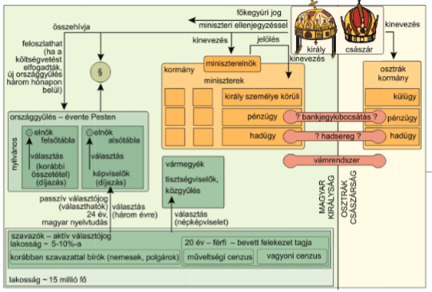

# 1848-49es forradalom  
## Forradalmi hullám  
- Ugyanazok az eszmék (Liberalizmus, nacionalizmus) mozgatták, mint a korábbiakat  
- Nyugat -> Kelet  
- Bécs: Március 13.  
- MO.: Március 15.  
- "A népek tavasza"  
- 48as OGy miként reagált az ellenzéki nyilatkozatra: Alsótábla elfogadta az ellenzéki nyilatkozat (Kossuth) pontjait (kötelező örökváltság, közteherviselés, felelős kormány, alkotmány az örökös tartományoknak) (reformintézkedések), a felsőtábla és a kormányzat időhúzással próbálta átvészelni az időszakot, viszont a bécsi forradalom és a pesti mozgolódás hírére a felsőtábla is elfogadta a felirati javaslatot (Március 14.), másnap hajón vitte a gyűlési küldöttség Bécsbe a feliratot  
- Hogyan zajlott a márciusi forradalom?: Pesten a bécsi forradalom hírére 15.én a Fiatal MO. (márciusi ifjak), Pilvax Kávéházban gyűltek, megfogalmazták a 12 pontot és a nemzeti dalt. A 12 Pont és hozzátartozó eszmék: "Mit kíván a magyar nemzet. Legyen béke, szabadság és egyetértés"  
  1. Sajtószabadság: Liberalizmus  
  2. Felelős minisztérium: Nacionalizmus/Liberalizmus  
  3. Évenkénti OGy.: Nacionalizmus  
  4. Törvény előtti egyenlőség: Liberalizmus  
  5. Nemzeti őrsereg: Nacionalizmus  
  6. Közös teherviselés: Liberalizmus  
  7. Urbéli viszonyok megszűntetése: Liberalizmus  
  8. Képviselet egyenlőség alapján: Liberalizmus  
  9. Nemzeti bank: Nacionalizmus  
  10. Katonaság az alkotmányra esküdjön, magyar katonákat ne vigyék külföldre, külföldieket vigyék el tőlünk: Nacionalizmus  
  11. Politikai statusfoglyok szabadon bocsájtása: Liberalizmus  
  12. Unió (erdélyel): Nacionalizmus  
- A Márciusi ifjak képviselői megmozdulása sikeres forradalom lett. A fiatalok maguk mellé állították az egyetemistákat, majd a polgárokat. Landerernél a cenzúra mellőzésével kinyomtatták a 12 pontot (Sajtószabadságot megvalósítva) és a Nemzeti Dalt. Délután a forradalom siker hatására csatlakozott Pest vezetősége is, majd Budán a Helytartótanács.  
  
- Gyűlés Pilvax Kávéházba eleinte  
- Egyetemhez elmentek  
- Majd a Landerer és Heckenasthoz, akik a Cenzúra ellenére kinyomtatták a 12 pontot  
- Elment a nép a Nemzeti Múzeumtól elmentek a Helytartótanácshoz, hogy Táncsics Mihályt kiszabadítsák  
- Nyereség  
  
- Márciusi ifjak átadták közben a vezetést a Liberális nemességnek, innentől a forradalom hatására is elfogadják a reformokat, avagy az **Áprilisi Törvények**et  
- Áprilisi Törvények:  
  - Előzmény: Az első felelős minisztérium létrejött, a Nagykoalíciós kormány  
  -   
  - 1848.Április 11-én szentesítve lettek a rendi OGy. által kidolgozott törvények -> Magyarország polgári átalakulását megfogalmazták  
  - MO. az OGy.-nek felelős kormánnyal rendelkező alkotmányos monarchiává alakult, egyesült erdéllyel. **(Feudalizmus -> Polgári állam)**  
  - A OGy. rendi -> népképviseleti alapú  
  - Műveltségi és vagyoni cenzus  
  -   
  - OGy. Pesten lesznek, a Parlamentben, évenként  
  - Feudális kiváltságok felszámolása  
    - Megyszűnt az úriszék  
    - Egyházi tized megszűnt    
    - Jobbágyfelszabadítás Kötelező örökváltsággal, állami kárpótlással (mert a jobbágyok megtarthatták telkeiket), elhalasztott kifizetéssel  
    - Földesúri adók megszünnek (pl. robot)  
    - Szabadságjogok megvalósulása  
    - Cenzúra eltörlés  
    - Nemzeti bank  
- nem valósult meg:  
  - Külügy  
  - Hadügy  
  - Ezeket szolgáló pénzügy  
- Szentesítette: V. Ferdinánd (avagy a Habsburg király)  
# 1848 Szabadságharc  
- A nemzetiségekkel szembeni hozzáállás: Egy politikai nemzet van csak  
- Milyen kérdéskörben volt a fő ellentét az osztrákok és a magyar vezetés között?: A hadügy- és pénzügyminisztérium jogkörét fel akarták számolni az osztrák kormányok, főként a hadsereg kérdésében voltak ellentétek. A magyaroknak megbízható csapatok kellettek volna, az osztrákok viszont többször megtagadták a csapatok küldését.  
- Milyen magyar lépések történtek emiatt?:  
  - Batthyány elrendelte a tíz honvédzászlóalj (magyar reguláris) csapatok felállítását (Május 16.), ez erősítette a magyar államot és megkérdőjelezte a birodalom egységét  
  - Kossuth szerződést kötött a Pesti Magyar Kereskedelmi Bankkal önálló magyar bankegyek kibocsájtására (Június 17., Kossuth bankónak nevezik)  
  - Július 11.-én emberenként szavazták meg a 200 ezer újoncot, és a szükséges pénzt  
- Kiket használt fel az osztrák kormányzat a magyarok ellen?: Nemzetiségek  
- Mi történt 1848. Augusztus 31.-én?: Pénz és hadügy vissza (nem valósul meg)  
- Hogyan, mikor kezdődött a fegyveres konfliktus?: 1848.Szeptember 11.-én, Horvát (Jelačić csapatai) támadás proxy háborúban (V. Ferdinánd aláírta az Áprilisi törvényeket, közvetlen nem indíthatott háborút a magyarok ellen)  
- OHB: Országos Honvédelmi Bizottmány, a végrehajtói (kormány) hatalom (1848.Okt.8. után), a honvédelmet irányító testület, vezetője Kossuth  
- Hol, hogyan zajlott az első összecsapása a szabadságharcnak?  
  - 1848.Szeptember 29.  
  - Pákozd (Velencei-tótol észak-nyugatra)  
  - Első összecsapás:  
    - Batthyány nyomására feltartóztatta a Móga altábornagy az új honvéd zászlóaljakkal Jelačić seregért  
    - Vereséget mértek rájuk  
- Mi történt Schwechatnál, 1848. Okt. 30.-án?  
  - A Pákozdi vereség után menekül Jelačić csapatjaival, Bécs irányába  
  - Móga követte Jelačić seregeit, de az osztrák határt csak Kossuth utasítására lépte át (ez lelassította őket)  
  - Kitört egy újabb Bécsi forradalom Október 6.-án, mely által teremtett lehetőséget nem tudtak kihasználni  
  - A Csehországban "rendet" teremtő Windisch-Grätz (Windics Grécz) csapatai megérkeztek, leverték a magyar sereget  
- Mi történt V. Ferdinánddal 1848. Decemberében?  
  - Lemondatták V. Ferdinándot, Ferenc Józsefet választották meg az Osztrák császárrá helyette, mert Szentesítette az Áprilisi Törvényeket, viszont arra hivatkoztak, hogy megőrült. 1848.December 3.-án vette át az uralkodást Ferenc József  
- Ki az a Görgey Artúr, és milyen ellentét volt Kossuth és közte?  
  - Görgei Artúr a Feldunai sereg vezetője, a túlerő miatt visszavonult, miközben az OHB óriási erőfeszítéseket tett az újabb csapatok érdekében. Görgei a fővárost is feladta, evvel megőrizte hadseregét, és Pestet a harctól.  
  - Kossuth Politikai, Görgei Katonai szemmel látja a dolgokat. Kossuth nyílt csatában akar szembeszállni Windsich-Gräzt-el, Görgei viszont visszavonult, és ... (házi, Tk.185 táblázat)  
- Hajlandó lett volna a békére az országgyűlés?  
  - Igen, az OGy. követséget küldött Windisch-Grätzhez, hogy milyen áron tudnának békét biztosítani, viszont a Császári fővezér nem volt hajlandó tárgyalni  
- Hova költözött a kormány?  
  - Debrecenre, Kossuth javaslatára az Országgyűlés megszavazta, hogy az OHB-vel, a minisztériumokkal együtt átteszi a székhelyet Debrecenbe, a fegyvergyártást pedig Nagyváradra telepítik  
- Mi történt Erdélyben 1848 őszén?  
  - Az Erdélyi Császári haderő nyíltan szembefordult a magyar kormánnyal (Ez is Bécs hibája, katonatartományokat ígért). A román parasztok és határőrök rátörtek a gyenge magyar haderőre, majd ősz végére a császáriak elérték Kolozsvárt. Itt álltak meg, mert elkezdődött a Székely felkelés  
- Ki volt Gábor Áron?  
  - Egy Székely, aki régen tüzérként szolgált, és vállalta, hogy ágyúkat önt. Az általa kiképzett újoncokról Puchner azt hitte, hogy képzett francia tüzérek. A szabadságharc alatt kb 100 ágyút öntött, és ő is tüzérként harcolt és abbe halt bele 1849-ben  
- Bem József vezette seregek milyen eredményeket értek 1849-első hónapjaiban?  
  - Sikeresen szervezte és erősítette az erdélyi hadsereget  
  - Márciusra kiverte az osztrákokat és a segítségükre siető orosz csapatokat erdélyből  
  - A román felkelést a Szigethegység területére szorította vissza  
- Mi az a felvidéki hadjárat?  
  - Gorgei kiürítette Pestet és Vácon át a felvidék felé vonult, elvonta Windsich-Grätz főerőit a kormány új székhelye megtámadásától. A terv sikeres volt, a császári erők főparancsnoka tartott, hogy a magyar hadtest váratlanul Bécs ellen fordul, ezért csapatai egy részét Pest körül tartotta, míg Görgei üldözésére is küldött jelentős erőket. Így nem indíthatott támadást Debrecen irányába, a magyar felkészülés a Tiszántúlon folytatódhatott.  
