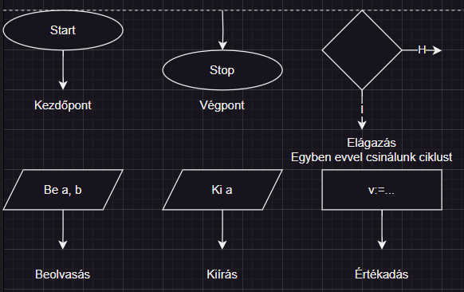
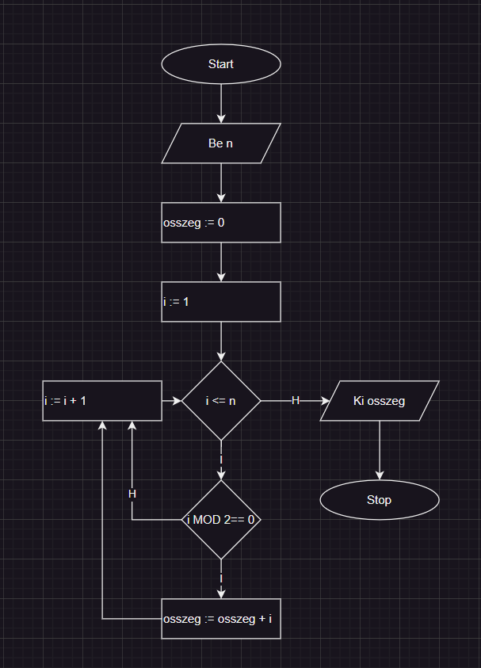
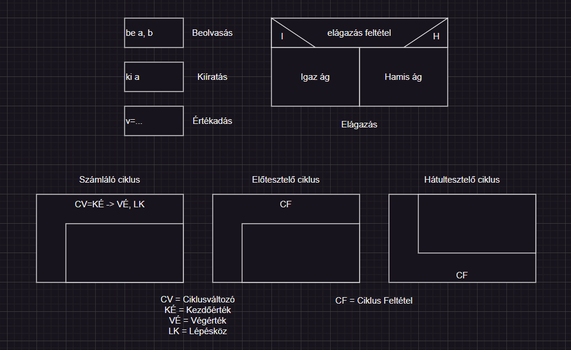
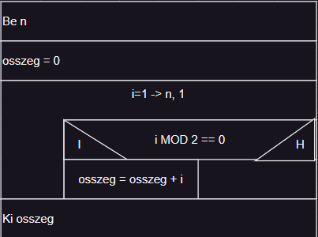

# Algoritmus leíró eszközök  
- Egy algoritmus végrehajtásához szükséges lépéseit leíró eszköz  
- A következőkben ezt az algoritmust írja majd le ez a fájl:  
```cs  
static void Main(string[] args)  
{  
	Console.Write("Adj meg egy pozitív egész számot: ");  
	int n = int.Parse(Console.ReadLine());  

	int osszeg = 0;  
	int i = 1;  
	while (i <= n)  
	{  
		if (i % 2 == 0)  
		{  
			osszeg += i;  
		}  
		i++;  
	}  

	Console.WriteLine("A páros számok összege: " + osszeg);  
}  
```  
- 3 fő eszközünk van erre  
## Folyamatábra  
- A különböző elemek, amiket használunk a leírásra  
  
- A program elírva ezen eszközzel:  
  
## Struktogram  
- A különböző elemek, amiket használunk a leírásra  
  
- A program leírva ezen eszközzel:  
  
## Mondatszerű leírás  
- Majdnem ugyanúgy íródik, mint a forráskód szokott  
```  
eljárás Main  
	be: n  
	osszeg := 0  
	i := 1  

	ciklus amíg i <= n  
		ha i MOD 2 == 0 akkor  
			osszeg := osszeg + i  
		elágazás vége  
		i := i + 1  
	ciklus vége  

	ki: osszeg  
eljárás vége  
```  
