# Elemi programozási tételek  
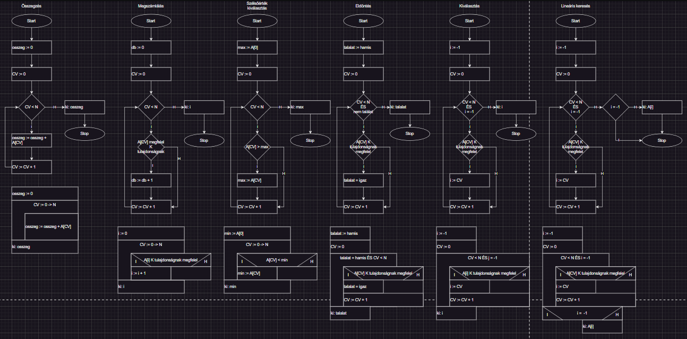  
## Összegzés  
- Egy sorozat elemeinek összegét számítjuk ki  
- Végigmegyünk az összes elemen, és egy változóban folyamatosan hozzáadjuk az értékeket  
### Folyamatábra  
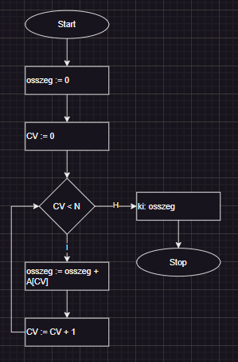  
### Struktogram  
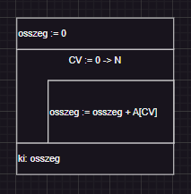  
### Mondatszerű leírás  
```  
eljárás osszegzes  
	osszeg := 0  
	ciklus i := 1 -> N  
		osszeg = osszeg + A\[i]  
	ciklus vége  
	ki osszeg  
eljárás vége  
```  
## Megszámlálás  
- Megszámoljuk, hány elem felel meg egy adott feltételnek  
### Folyamatábra  
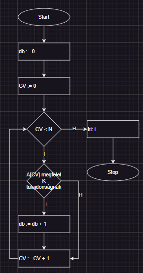  
### Struktogram  
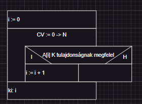  
### Mondatszerű leírás  
```  
eljárás megszamlal  
	j := 0  
	ciklus i := 1 -> N  
		ha A\[i] K tulajdonságnak megfelel  
			j = j + 1  
		elágazás vége  
	ciklus vége  
	ki j  
eljárás vége  
```  
## Szélsőérték kiválasztás  
- Más néven min/max kiválasztás  
- A legkisebb vagy legnagyobb elemet keressük a sorozatban  
### Folyamatábra  
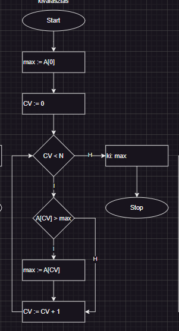  
### Struktogram  
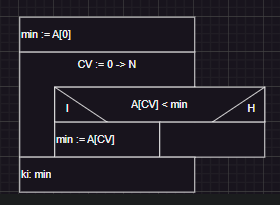  
### Mondatszerű leírás  
```  
eljárás minimum  
	min := A\[1]  
	ciklus i := 2 -> N  
		ha A\[i] < min:  
			min := A\[i]  
		elágazás vége  
	ciklus vége  
	ki min  
eljárás vége  
```  
## Eldöntés  
- Megállapítjuk, hogy van-e olyan elem, ami megfelel egy feltételnek  
### Folyamatábra  
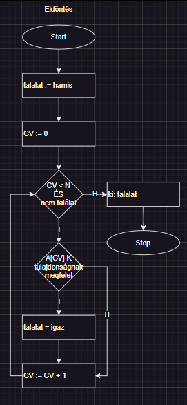  
### Struktogram  
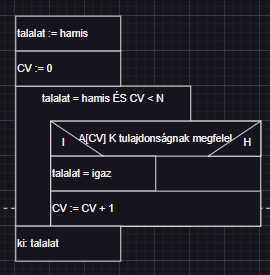  
### Mondatszerű leírás  
```  
eljárás eldontes  
	j := hamis  
	ciklus i := 1 -> N  
		ha A\[i] K tulajdonságnak megfelel, akkor  
			j := igaz  
		elágazás vége  
	ciklus vége  
	ki j  
eljárás vége  
```  
## Kiválasztás  
- Megkeressük az első elemet, amely megfelel egy feltételnek  
### Folyamatábra  
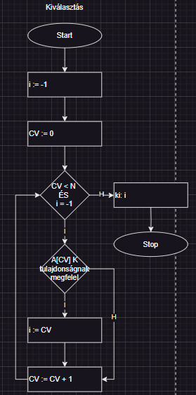  
### Struktogram  
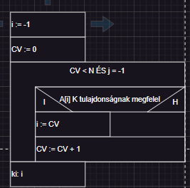  
### Mondatszerű leírás  
```  
eljárás kivalasztas  
	j := -1  
	i := 1  
	ciklus amíg j = -1 és i < N  
		ha A\[i] K tulajdonságnak megfelel, akkor  
			j := A\[i]  
		elágazás vége  
	ciklus vége  
	ki j  
eljárás vége  
```  
## Lineáris keresés  
- Egyesével lépkedünk végig a sorozaton, amíg egy `P` tulajdonságú `A` elemet nem találunk  
	- Ennek megtalálása után abbahagyjuk a keresést, és visszaadjuk az `A` elem indexét  
	- Különben `-1`  
### Folyamatábra  
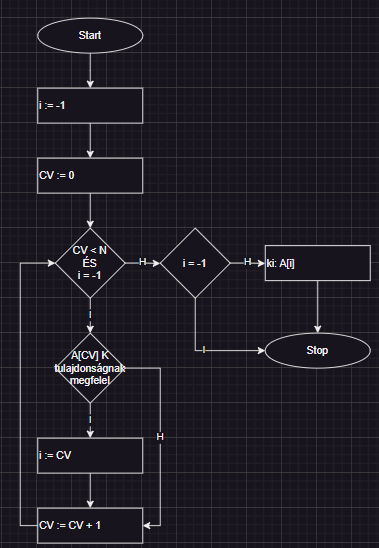  
### Struktogram  
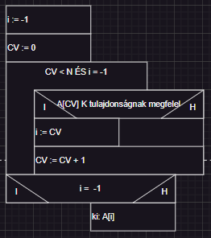  
### Mondatszerű leírás  
```  
eljárás linearis  
	j := -1  
	ciklus amíg j = -1 és i < N  
		ha A\[i] K tulajdonságnak megfelel, akkor  
			j := i  
		elágazás vége  
	ciklus vége  
	ki j  
eljárás vége  
```  
