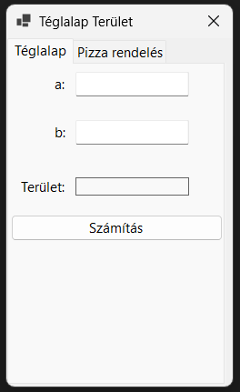
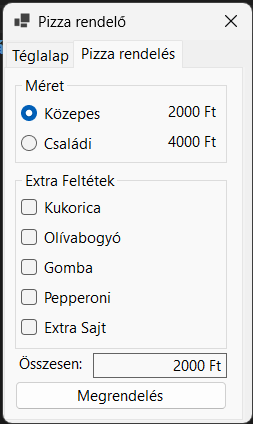
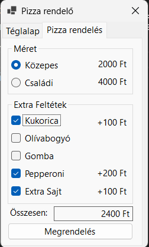
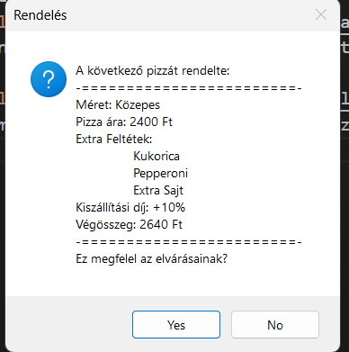

# Pizza Rendelő  
Készítette: Molek Tamás Sándor  
## Felhasználói Dokumentáció  
Az alkalmazás egy pizza rendelésére felületet készít a felhasználónak, ahol egy (1) pizzát rendelhet egyszerre a felhasználó  
A felület, amikor elindítja a programot egy téglalap területének kiszámítására alkalmas felületet fog mutatni.  
  
A felület tetején látható, hogy van, egy `Pizza rendelés` fül, amire rányomva a program átvált a pizza rendelő felületre  
  
Itt a felhasználó akármilyen kombinációban feltéteket tehet a pizzára. Az feltétek kiválasztásakor megjelenik az elem ára a gomb mellett  
  
Amikor megnyomja a `Rendelés` gombot, megkérdezi egy ablakban, hogy megfelelő-e a rendelés  
  
A program rárak egy +10%-ot a végösszegre, mint kiszállítási díj  
## Fejlesztői Dokumentáció  
### A program lefuttatása  
Rendszerkövetelményei a programnak:  
- Windows operációs rendszer  
- .NET 10.0+  
- C# Futtatására képes program  
	- Lehet akár csak szimpla `dotnet` paranccsal (`dotnet run`)  
### A program összetétele  
A pizza rendelő programot érintő kódrészlet egy C# `region` részben van csoportosítva, benne több `region`ra osztva a kód  
#### Ablakcím változtatása  
A fülek változása alapján való ablakcím átírásra használt metódus  
```cs  
private void mainTabControl_SelectedIndexChanged(object sender, EventArgs e)  
{  
	if (mainTabControl.SelectedIndex == 0)  
	{  
			this.Text = "Téglalap terület";  
	}  
	else  
	{  
			this.Text = "Pizza rendelő";  
	}  
}  
```  
#### Helper funkciók  
A program a pizza árának kiszámítására a program a statikusan megadott értékeket használja, amiket a `label`ekből szerez a következő metódussal  
```cs  
private int getPrice(Label label)  
{  
		return int.Parse(label.Text.ToLower().Replace("ft", "").Replace("+", "").Trim());  
}  
```  
Az összegnek a változtatására pedig a programnak van egy `setPrice` metódusa, ami minden feltét változtatásnál lefut  
```cs  
private void setPrice(Label itemPriceLabel, CheckBox itemCheckBox)  
{  
		priceLbl.Text = (getPrice(priceLbl) + getPrice(itemPriceLabel) * (itemCheckBox.Checked ? 1 : -1)).ToString() + " Ft";  
}  
```  
Annak érdekében, hogy az érték lemehessen amikor egy feltétet leveszünk a pizzáról, a metódus bekéri a `CheckBox` elemet, hogy ellenőrizze, hogy hozzá kell-e adni, vagy ki kell vonni, amit a következő kódrészlet szabályoz be:  
```cs  
...* (itemCheckBox.Checked ? 1 : -1)  
```  
#### Feltétek régió  
Ez a része a programnak azért felelős, hogy látható legyen-e az árnak a `Label`je. Minden feltétnek ugyan az a logikája, csak a `Label` és `CheckBox` elemek változnak a feltétek között. Ez a példa a kukorica feltétnek a részlete  
```cs  
private void cornChk_CheckedChanged(object sender, EventArgs e)  
{  
		cornPriceLbl.Visible = cornChk.Checked;  
		setPrice(cornPriceLbl, cornChk);  
}  
```  
#### Méretek régió  
Ez a rész a méretet kiválasztásakor fut le. Kettő funkció van ebben a régióban, viszont logikailag hasonlóak.  
Ez a példa a közepes méretre váltáskor fut le  
```cs  
private void mediumSizeRadio_CheckedChanged(object sender, EventArgs e)  
{  
		if (!mediumSizeRadio.Checked) { return; }  
		priceLbl.Text = (getPrice(priceLbl) - getPrice(csaladiPriceLbl) + getPrice(mediumPriceLbl)).ToString() + " Ft";  
}  
```  
#### Rendelés gomb  
A rendelés leadásakor a következő kódrészlet fut le, hogy megmutassa a felhasználónak, miért fizet  
```cs  
const byte deliveryFeePercent = 10;  
private void orderBtn_Click(object sender, EventArgs e)  
{  
	string msgText = "A következő pizzát rendelte:\n-========================-\n";  
	msgText += $"Méret: {(mediumSizeRadio.Checked ? "Közepes":"Családi")}\n";  
	msgText += $"Pizza ára: {priceLbl.Text}\n";  
	HashSet<string> feltetek = new HashSet<string>();  
	if (cornChk.Checked) feltetek.Add(cornChk.Text);  
	if (oliveChk.Checked) feltetek.Add(oliveChk.Text);  
	if (mushroomChk.Checked) feltetek.Add(mushroomChk.Text);  
	if (pepperoniChk.Checked) feltetek.Add(pepperoniChk.Text);  
	if (extraCheeseChk.Checked) feltetek.Add(extraCheeseChk.Text);  
	if (feltetek.Count > 0)  
		msgText += $"Extra Feltétek:\n\t{string.Join("\n\t", feltetek)}\n";  
	msgText += $"Kiszállítási díj: +{deliveryFeePercent}%\n";  
	msgText += $"Végösszeg: {getPrice(priceLbl)*(1+deliveryFeePercent/(double)100)} Ft\n";  
	msgText += "-========================-\nEz megfelel az elvárásainak?";  
	MessageBox.Show(msgText, "Rendelés", MessageBoxButtons.YesNo, MessageBoxIcon.Question);  
}  
```  
A `deliveryFeePercent` `byte` típusú konstans megadja, hogy hány százalékot adjon rá a végösszegre, mint kiszállítási díj.  
