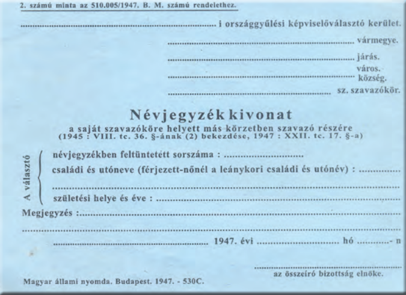

# Szovjet megszállás ("felszabadítás") Magyarországon  
- A szovjetek megszállták az országot (1944-1945)  
## Mi az a SZEB?  
- **Szövetséges Ellenőrző Bizottság**  
	- Szovjet irányítású  
	- Minden "szabadított" területen létrejött  
- A szuverinitást elvesztő államokban a hatalom az ő kezükbe került	  
- Jogai  
	- Pártok szabályozása  
	- Ellenőrizhette a pártok működését  
	- Állampolgárokat letartóztathattak  
	- Törvényeket eltörölni, elfogadtatni  
	- Miniszteri pozíciók kiosztása  
## Mivel biztosítják a kommunisták hatalmát?  
- A nemzetiszocialista és nyilasuradalmat felszámolták a SZEB segítségével  
- Eleinte demokratikusnak kinéző folyamattal, több éves program  
- Kihasználták az erőszakszervezeteket (rendőrség, belügyminisztérium) a politikai harcban  
## Milyen bűnöket követtek el a szovjetek?  
- Erőszak  
- Kényszermunka  
- Szólásszabadság korlátozása  
## Milyen veszteségei voltak a Magyarságnak?  
- 800-900 ezer magyar katona került fogságba, közel 2/3 szovjet táborokba  
- 150-200 ezer magyar katona elesett a frontokon  
- kb. 200 ezer civil halt meg bombázásokba és frontharcok  
## Mi az a Malenkij-robot  
- Kényszermunka  
- Többszáz ezer magyar állampolgárt hurcoltak el rá  
#  ENSZ  
- 1945 - Egyesült Nemzetek Szervezete (ENSZ) létrejött  
- Felépítésében a nagyhatalmak erőfölénye érvényesült  
- Kezdetben a vesztes államok nem voltak tagjai  
## Felépülése  
  
### Biztonsági tanács  
- Röviden BT  
- A lényeges kérdések itt dőlnek el  
- 7 igen szavazat kell  
- Öt állandó + 6 évente változó  
- Állandó tagok  
	- USA  
	- Szovjetunió  
	- Franciaország  
	- Nagy-Britannia  
	- Kína  
- Az állandó tagok vétójoggal rendelkeznek  
- Az állandó tagok összetétele egyszer változott  
	- 1949, Kína - Polgárháború  
	- Az eddigi vezetés Tajvanra szorult vissza  
	- 1971-ben felváltotta a Rendszerű Kínát a Kínai Köztársaság  
- A nem állandó tagok számát 1966-ban megemelték  
	- a Biztonsági Tanács tagjainak száma tizenötre emelkedett  
	- Nem jelentett lényegi változást a tanács múködésében  
## Védnökség alatti szakirányú szervezetek  
- Példák (tudni kell)  
	- UNESCO - Oktatás és kultúra  
	- FAO - Élelmezés és mezőgazdaság  
	- WHO - Egészségügy  
	- IMF - Nemzetközi valutaalap  
- Egyeztetnek a problémák megoldásában  
- Közbelépnek katasztrófáknál  
## Békefenntartók  
## Nemzetközi bíróság  
- Hága  
- ENSZ pereli az embereket itt  
	- Legtöbbször háborús bűncselekményeket, vagy emberi jogok megszegéséért  
## Közgyűlés  
- Évente ülésezik  
- Minden tagállam részt vesz  
- Minden államnak 1 szavazat  
	- Fontos kérdésekben 2/3os többség  
	- Egyébként egyszerű  
## Bretton Woods-i konferencia  
- 1944 nyara  
- 44 ország képviselésével  
- A világ döntő pénzügyeire ekkor döntő mértékben volt hatással az USA, ők irányították az eseményeket  
- A jövő világában a szabadkereskedelmet biztosították, és ennek pénzügyi alapjait meg kívánták teremteni  
- Az egyezmény aláírói vállalták, hogy  
	- Egyeztetik pénzügyi politikájuk  
	- valutájuk átváltási arányait az aranyhoz mérve rögzítik, csak kis mértékben térhetnek el (1%)  
- Közvetítő valutává vált a dollár  
- Létrehozták a nehézségek "áthidalására" a Nemzetközi Újjáépítési és Fejlesztési Bankot (Világbank) és Nemzeti Valutaalapot (IMF)  
# A Bipoláris (kétpólusú) világ kialakulása  
- WW2 után 2db szuperhatalom emelkedik ki  
## Szuperhatalmak létrejötte  
### Az Egyesült kiráyság  
- Gazdaságuk teljesen megrendült, eladósodott az USA felé  
- Latható volt, hogy a fegyverkezési kiadásokat nem lesz képes vállalni -> Egyesült királyság csak másodrendű nagyhatalom lett  
### Franciaország  
- Vichy vezetését elfelejtették  
- Győztesek közé tartozott, mivel így a szovjetuniót tudták ellensúlyozni a megszállt Németországban  
### USA  
- A többi állammal ellentétben ők tovább erősödtek  
- A háború fellendítette a gazdaságukat, megviselés helyett  
- A háború indította meg a gazdasági világválság utáni valódi fellendülést  
- Az atombomba birtoklásával egyértelműen a föld vezető nagyhatalma lett  
### Szovjetunió  
- Óriási veszteségek WW2-ben  
- A 12 milliós hadseregük miatt a második nagyhatalommá emelkedett  
- Ezennel kétpúlusú lett a világ  
	- Az USA és SzU kiemelkedett  
	- Csak ők tudták előteremteni békében is a hadseregfejlesztéshez szükséges összegeket  
	- A jövőben a két szuperhatalom állása döntött a jelentős kérdésekben  
# Churchill Fultoni beszéde (1946)  
- Nem volt eddigre Churchill hivatalban, szabadabban fogalmazhatott  
- Vázolta  
	- A folyamatos szovjet előretörést  
	- A köztes-európa szovjetizálását  
	- A szovjezek által megszállt országokat elzáró vasfüggöny kialakulását  
- Kijelentette, hogy amennyire lehet kerülni kell a háborút, ehhez fegyverkezni kell, mert a szovjeteket csak az elrettentő erő fogja megállítani  
- Sztálin nyíltan reagált  
- Sokan innen számítják a hidegháború kezdetét  
# Feltartóztatási politika  
- 1946 után felgyorsultak az események  
- 1947 - Truman megfogalmazta az USA külpolitika irányait és a feltartóztatási politika alapjait  
- A szovjetek 1947es előretöréseit tudomásul vették, de parancsolták a megállást, nem tűrtek el több területnyerést  
- Fokozták az USA katonai jelenlétét  
- Támogatták a polgári erőket a veszélyeztetett országokban  
- Fontos volt a szovjet behatolás által veszélyeztetett államokat támogatni, hogy visszaszorítsák a nyomort  
## Marshall terv  
- Fontos eleme volt a feltartóztatási politikának  
- Segélyprogram  
- A kommunista veszélyt felidéző nyugat-európai nyomort akarta felszámolni  
- Működőképessé kívánta tenni a térség gazdaságát  
- Biztosítani akarta az amerikai áruk piacát, az USA gazdaságának is fenntartását  
- Feltételekhez kötötték  
	- Az európai feleknek együtt kell működni, meg kell nyitniuk a piacukat egymás felé  
- A szovjetek ettől távol tartották magukat  
	- Nem voltak hajlandóak együttműködésre, az USA befolyás erősödését látta benne  
	- A szovjet befolyás alá került kelet-európai államokat is erre kényszerítette  
	- A Csehszlovákok eleinte elfogadták, de Sztálin nyomására visszahátráltak  
# Párizsi béke  
- A vesztes országok fegyverszüneti egyezményeikben elismerték a győztesek akaratát  
	- Erre példa: SZEB korlátozta a szuverinitást  
- Németországgal nem is kötöttek békét  
- A többi vesztessel (Bulgária, Finnország, Olaszország, Magyarország, Románia) 1947 februárjában, Párizsban megkötötték  
- A béke nem tartalmazta a Németországtól elcsatolt területek kérdését  
- A vesztes országoknak nagyrészt az 1937es határokat visszaállították  
	- Bulgária megtarthatta Dél-Dobrudzsát, de elvesztette Kelet-Trákiát (Görög terület lett)  
	- Románia visszakapta Erdélyt tőlünk, de elvesztette Besszarábiát  
	- Olaszország kénytelen volt átadni a dalmáciai területeit (Isztria, Spalato, Zára, Fiume) Jugoszláviának  
- Jóvátételi terheket megbeszélték  
## A Németkérdés  
- 10 millió német kitelepítése  
- Németországnak nem volt ilyenkor politikai szervezete (nácik kisajátították)  
- Németországot 4 megszállási övezetre osztották  
	- Szovjet  
	- Brit  
	- Amerikai  
	- Francia  
- Nem egyezett a felosztás a megszállások alatt tartott területekkel  
- Berlint kiemelték, azt is 4 részre osztották  
- Ausztria esetében ugyan ez történt  
# Berlini blokád  
- 1948 Június - 1949 Május  
- Mindenben hiányt szenvedtek a berliniek  
- Elzárták a forgalmat  
- A Nyugat Légi-hidat hozott létre az áruk szállítására  
# A 2 német állam  
- Két állam jött létre:  
	- NSZK  
		- Nyugat-Németország  
		- Német Szövetségi Köztársaság  
		- Demokrácia  
		- Konrad Adenauer  
			- Francia-Német békélést sürgetett  
			- Aláírta a Schuman tervet  
				- Francia-Német gazdasági együttműködés  
	- NDK  
		- Kelet-Németország  
		- Német Demokratikus Köztársaság  
		- Szovjetek által támogatott diktatórikus rendszer  
- NDK -> NSzK  
	- Berlinen keresztül  
	- A szovjetek ezt nem akarták -> Berlini fal megépítéséről döntöttek (1961)  
- 1949 Május  
# NATO  
- Észak-atlanti Szerződés Szervezete  
- Katonai Szervezet  
- 1949, San Francisco  
# Miért "Hideg" háború a megnevezés?  
- A szuperhatalmak között nem volt közvetlen háború  
# Feltartóztatási politika működésének bizonyítása  
## Koreai háború  
- Sztálin terjeszkedni akart  
- Sztálin állította, hogy közel álltak a WW3-hoz  
- A legközelebb a WW3hoz a Koreai konfliktus alatt voltak  
- A Japánok kiűzése után (1945) az Amerikai és Szovjet megszállást követően 2 korea jött létre:  
	- Kommunisták északon  
	- Kapitalisták délen  
- 1950 - Sztálin és Mao Ce-tung jóváhagyásával a felfegyverkezett északi kommunista hadsereg váratlanul megtámadta dél koreát, majdnem az egész országot elfoglalták  
- Az USA azonban kihasználta az ENSZ felhatalmazást, 1950 végén már a kínai határ végén folytak a harcok  
	- Sztálin kérésére a kínaiak "önkéntesekként" beléptek a harcokba, visszaszorították az ENSZ erőket  
- Végül nem volt béke, csak fegyverszünet (1953), ami ma is érvényben van  
## Vietnám  
- 1945, Vietnám  
- Vietnámban kommunista partizánok Ho Si Minh (felvett név, "felvilágosult") vezetésével kijelentették északon, Hanoiban a függetlenséget  
- A franciák nem ismerték el függetlenségüket, csapatokat küldtek a terület visszaszerzésére -> Indokínai háború kezdete  
- A francia lakosság nem akart se emberi, se anyagi veszteségeket  
	- A franciák csak amerikai pénzügyi támogatásokkal és fegyverszállításokkal bírták a harcot  
- 1954-es vereség után tárgyalóasztalhoz ültek a franciák  
- Genf, 1954  
	- Vietnámot ketté osztották  
		- Északi, Kommunista állam  
		- Déli, Kapitalista állam  
	- A kommunisták evvel nem értettek egyet, tovább folytatódtak a harcok  
- A kommunisták visszafoglalását a Szovjetek és kínaiak támogatták  
- Az USA a déli rész függetlenségéért küzdött, amit az észak nem akart  
- 1972 - Az Amerikai és észak-vietnámi küldöttség a dél-vietnámi küldöttség tudta nélkül megállapodott  
	- Az USA már eldöntötte 1968-ban, hogy kivonul a területről, a legkisebb presztízsvesztéssel ha lehet  
	- Kivonult az USA az 1973-ban harcoló erőivel az országból  
	- A Dél-Vietnám rezsimet továbbra is óriási katonai-anyagi támogatásban részesítette  
- Ennek ellenére dél-vietnám ereje megtört, az északiak a békeszerződést megszegve megtámadták dél-vietnámot, elfoglalták Saigont (később Ho Si Minh-város)  
- Egyesült a két ország 1976-ban Vietnámi Szocialista Köztársaság néven  
## Kubai rakétaválság  
- 1962, Kuba  
- Kubában forradalom  
	- nyomor és az amerikaiakat kiszolgáló diktatúra ellen felléptek  
	- Fidel Castro vezetésével  
	- Győztek (1959)  
- A szovjetek támogatták Castro rendszerét, az egyre inkább kommunista jelleget öltött  
- Az USA a kubai emigránsokat akarta használni a Castro rendszer megdöntésére  
	- A szovjetunió válaszul atomrakétákat telepített Kubába, 1962-ben  
	- Az USA válaszul blokád alá tette Kubát  
- A két vezetőnek kompromisszumot kellett kötni  
	- A szovjetek kivonták a rakétát kubából  
	- Az USA lemondott Kuba lerohanásáról  
- Ezután rövidesen leszerelte az USA a törökországi atomrakétáikat is  
- Létrejött a "forródrót"  
## Afganisztán  
- A szovjetek megindultak az Olajválság miatt a közel-kelet irányába  
- Az USA a afgán guerillákat támogatta  
- A szovjeteknek annyira sok erőforrásba került volna elfoglalni őket, hogy inkább feladták  
# Mi az a McCarthyzmus?  
- Az USA-ban megjelent az ellenségeskedés, McCarthy szenátor a kommunista és baloldali értelmiség ellen lépett fel  
- Az embereknek maguknak kellett bizonyítani az ártatlanságukat  
- A mccarthyzmus sok ember életét ellehetetlenítette  
- A polgári demokrácia vissza tudta szorítani  
# Mi az a Varsói szerződés?  
- 1955, Varsó  
- Az NSzK felvétele a NATOba Hruscsovot (Sztálin halála utáni **(1953)** szovjet vezető) egy szocialista NATO készítésére erőltette  
- A szovjetunió csatlós államait tartalmazó katonai tömb  
# Mi az a KGST?  
- Kölcsönös Gazdasági Segítség Tanácsa  
- 1949\. Január 25\., Moszkva  
- Tagjai  
	- Szovjetunió  
	- Bulgária  
	- Csehszlovákia  
	- Lengyelország  
	- Magyarország  
	- Románia  
	- Albánia (1949, 1961 Felfüggesztette tagságát, 1987 - Kiléptek)  
	- NDK (1950)  
	- Mongólia (1962)  
	- Kuba (1972)  
	- Vietnámi Demokratikus Köztársaság (1978)  
	- Jugoszlávia  
- Feladatul tűzte ki  
	- A szocialista országok közti gazdasági együttműködés erősítését  
	- A gyengébb tagállamok felzárkóztatást (Munkamegosztás, specializálódás)  
		- Magyarország - autóbuszok gyártására szakosodás  
			- Az Ikarusz így jutott mindenhova a szocialista világban  
		- Csehszlovákia - a Tatra villamosok gyártására szakosodás  
		- NDK - halfeldolgozó halászhajók  
		- Bulgária - Ipari Targoncákra szakosodás  
- Fennállása alatt magyarországon és csehszlovákiában volt a legnagyobb az egy főre jutó GDP  
# SALT-1  
- 1972  
- A szuperhatalmak maximalizálták a rakétafegyvereket  
# Olajválság  
- 1973-1974  
- Arab-Izraeli háborúk 1973-as Jóm Kippuri háborújában Izrael megvédte az általa megszállt területeket -> Az olajtermelésbe beavatkoztak, négyszeresére emelték az olaj árát  
# Helsinki értekezlet  
- 1975  
- Kimondták, hogy törekszenek  
	- A békés, egymás mellett élésről  
	- A határok sértetlenségéről  
	- Alapvető emberi jogokról  
# Kishidegháború  
- A szovjetunió növelni akarta befolyását  
	- Afganisztánt megszállták  
	- Viszont az afrikában történő események megakasztották az enyhülés, békülés időszakát  
	- A szovjetek olajforrások felé indultak meg az olajválság miatt  
- Az amerikaiak az afgán gerillákat támogatták  
- Végül annyira költséges lett az afgán megszállás, hogy 1988-ban kivonultak a szovjetek  
# Carter-doktrína  
- USA megmondta, hogy fegyverrel is megvédik az olajforrásokat  
# Szovjet válság  
- Az olajárrobbanás után új világ köszöntött be  
	- Az a hatalom kerekedett fel, amely technológiában képes alkalmazkodni  
	- Ehhez a szovjet rendszer nem volt alkalmas  
		- Egyre jobban adósodtak, hogy hatalmukat fenntartsák  
# Csillagháborús terv  
- Ronald Reagan idején indult  
- Világűrbe telepített átfogó rakétavédelmi rendszer  
- A szovjetuniót a gazdasági válságuk miatt ez felbillenéssel fenyegette  
# Peresztrojka  
- "Átalakítás"  
- Gorbacsov reformprogramja  
- Életminőség romlásának megakadályozása  
	- Akár a fegyverkezés visszafogása által  
- Új külpolitikai hozzáállást követelt  
	- Területekről mondtak le  
	- Fegyverkorlátozásokról állapodtak meg az USA-val  
# Glásznoszty  
- Belső politikai változások része volt  
- "Nyilvánosság"  
- Az eddig politikából kizárt embereknek ekkortól lehetett hangot adni az elégedettlenségről  
# Német egyesülés  
- 1990\. Október 3\.  
- A győztes hatalmaknak le kellett mondani minden megszálló jogukról (Sz.U.-nak is)  
# Szocialista tömb és szovjetunió összeesése  
- Gorbacsov nem avatkozott be a szétesésbe  
	- A balti államok ellen fegyveresen próbáltak fellépni  
	- A régi kommunista Szovjetuniót feltámasztani vágyók sikertelen katonai puccskísérlete után abba is maradt  
- 1991\. December - Megszűnt a szovjetunió  
- Létrehozták a FÁK-ét  
	- Nem csatlakozott minden Szovjet tagállam  
# Kennedy végzete  
- Merénylet áldozata lett  
# Ki az a Martin Luther King  
- A feketék egyenlőségéért küzdő polgárjogi aktivista  
# Watergate botrány  
- Nixon elnök lehallgatási botránya  
- Sikertelenül megpróbálták eltusolni  
# Apartheid  
- Szegregációs politika 1994-ig Dél-Afrikában  
# Kommunista Magyarország  
## A SZEB szerepe  
- Engedélyezték az ellenzéki pártok működését  
	- FKgP (Független Kisgazda Párt)  
	- NPP (Nemzeti Parasztpárt)  
	- SzDP (Szociáldemokrata Párt)  
	- PDP (Polgári Demokrata Párt)  
	- MKP (Magyar Kommunista Párt)  
		- Rákosi Mátyás  
		- Nagy Imre  
		- Gerő Ernő  
		- Révai József  
## 1945ös választások  
- Minden 20 év feletti férfi és nő szavazhatott  
	- Kivéve háborús bűnösök  
- Pártlistás szavazás volt, nem egyéni  
- az FKgP volt a legnagyobb ellenzék  
- 57.03%-os FKgP nyereség  
	- Egyértelmű többség  
	- Viszont a SZEB beavatkozott  
		- A Kormányt kényszeríti, hogy kommunistákat rakjanak a pártba (Belügy)  
## Mi az, hogy Szalámi taktika?  
- Kikiáltották, hogy M.O. köztársaság legyen (1946\. Február 1\.)  
- Az államformától eltekintve minden kérdésben harc volt az FKgP és MKP között  
- A kommunisták még több hatalomhoz akartak jutni  
	- Felhasználták a tömegeket, a demagógia és megfélemlítés eszközeit  
	- Kis lépésekben történő térnyerés  
	- Kihasználták a Vörös Hadsereg által biztosított erőfölényt  
		- Visszaszorították a számukra veszélyes csoportokat a rivális pártokról, "felszeletelve" őket (Szalámitaktika)  
		- A pártokon belül kommunista baloldali csoportok létrehozásán ügyködtek, hogy megosszák e a pártokat  
## Kommunista agitáció, a "Földet vissza nem adunk" rígmus  
- Volt Földosztás, elvették a kisebb területeket is  
	- az FKgP szót emelt róla  
	- MKP: "A kisgazdák veszik el az emberektől a földet"  
	- Nép be like: "GRRRRR"  
## Baloldali blokk  
- az MKP kezdeményezte a baloldali blokk megalakítását  
	- Résztvevők  
		- MKP  
		- SzDP  
		- NPP  
	- 1946 Március  
	- Támadást indítottak a kisgazdák ellen  
		- A párt polgári vonalát jobboldalinak minősítették (A korszakban a demokrácia tagadása)  
## Hogyan alkalmazták a szalámi taktikát kisgazda párton az MKP?  
- 20 képviselőt kizártak  
- Vádemelések  
## Mi az a "B" listázás?  
- Állandósultak a támadások a kisgazdák ellen  
- "B" listázást hajtot az MKP végre a közigazgatásban  
	- Politikai megbízhatóság szempontjából vizsgálták felül az alkalmazottakat  
	- 1946 nyarán, egy szovjet katona lelövése után Rajk László 1500+ egyházi és társadalmi szervezetet, egyesületet tiltott be  
		- Katolikus Legényegylet  
		- Magyar Cserkészszövetség  
		- Bélyeggyűjtő egyletek  
## Mi történt a magyarországi németekkel? Mi az a lakosságcsere?  
- Ki lettek zárva a 45-ös választásokból  
- Háborús bűnösöknek lettek tekintve  
- 200k+ kitelepítve Németországba  
- A Potsdami értekezlet döntött kitelepítésükről  
	- A döntést a magyar Ideiglenes Nemzeti Kormány és a politikai pártok többsége támogatta  
- Javaiktól megfosztott svábok -> Free föld -> Osztják a földet mint a cukorkát  
- Szlovák-Magyar Lakosságcsere  
	- A felvidéki magyaroknak az 1946-os egyezmény jelentős veszteséget jelentett, sok szenvedést eredményezett  
	- Viszont a magyarországi Szlovákság is jelentősen csökkent  
## Mire hivatkozva maradtak szovjet csapatok az országban a párizsi béke után?  
- A németek elleni háború lezárása  
- 1947es Párizsi békeszerződés  
	- Addig tarthatták a katonáikat az országban, amíg ausztriában vannak csapatok  
## Hogyan számoltak le végleg a kisgazdákkal?  
- 1947-től gyorsítani akarták a kommunisták a hatalomátvételt  
- A kommunisták kezében lévő ÁVO a tények torzításával, a veszély felnagyításával államellenes összeesküvést "leplezett le"  
	- 1947 Január  
	- Belekeverték a kisgazda politikusok egy részét  
	- "Köztársaságellenes összeesküvés"  
	- Többeket letartóztattak  
		- Kovács Bélát nem sikerült megfélemlíteni, a szovjet hatóságok elhurcolták (1947\. Február 25\.)  
	- Szabadságát Svájcban töltő Nagy Ferencet megvádolták az összesküvésben való érintettséggel  
		- Családját is fenyegetve érezte  
		- Lemondott miniszterelnöki tisztségéről  
		- Emigrált  
## Sikerült parlamenti többséget szereznie a kommunistáknak?  
- Elért az MKP **22%**-ot a szavazásokon, evvel a legnagyobb párttá válva  
- Kizárták a Magyar Függetlenségi Párt eredményeit a szavazásból  
	- Választási csalás ürügyén megsemmisítettek 670k szavazatot  
- Az FKgP nem mert kiválni a jelenlegi kormánykoalícióból  
	- ismételten az MKP, SzDP, FKgP és NPP alakított kormányt  
	- Most az MKP vezetésével  
### Miért kékcédulás választás a megnevezése az 1947-es választásoknak?  
  
- A nem lakóhelyén szavazni kívánó állampolgárok igazolása, hogy szerepelnek a választói jegyzékben  
- Az MKP irányította a Belügyminisztériumot, a szociáldemokraták az Igazságügyi minisztériumot  
	- Megszerezhették a kék cédulákat  
	- Elkenhették a csalás kivizsgálását  
	- Több tízezer hamis szavazatot könyvelhettek el  
## Hogyan jön létre a totális diktatúra?  
- A hatalom megszerzésében fontos volt, hogy a munkásosztálynak egy pártja legyen  
	- Ennek a nevében kényszerültek az egyeduralomra  
	- Így a parlamenti arányok is alátámasztják egyeduralmukat  
	- Kierőszakolták az MKP és SzDP egyesülését  
		- Ezt megelőzte az SzDP-ből az MKP-vel való együttműködést ellenző, jobboldalinak tekintett vezetők letartóztatása  
			- Peyer Károly  
			- Kéthly Anna  
		- Megalakult az **MDP** (**Magyar Dolgozók Pártja**, 1948)  
### Melyik év a fordulat éve és miért az?  
- 1948  
- Az MDP felszámolta a többpártrendszert  
	- Megvalósultak a proletárdiktatúra feltételei  
- A kommunisták ezért ezt az évet tekintik a "fordulat évének"  
## Mi lesz magyarország államformája 1949-ben?  
- Népköztársaság  
## Mit fogadtak még el 1949-ben  
- Új alkotmány  
	- Rögzítette a kommunista párt hatalmát  
	- Államforma = népköztársaság  
	- Önkormányzatok -> Tanácsrendszer  
- "Első titkár"  
- Elnöki tanács  
	- Köztársasági elnök szerepét átvette  
- Ez pártállam, mivel az állami élet az MDP kezében volt  
## Rákosi Korszak (1949-1953, 1956)  
### Hogyan viszonyultak a korszakban az egyházhoz?  
- Az MKP majd MDP számára fontos része volt a politikai és ideológiai harcnak az egyház visszaszorítása  
	- Ők jelentették az egyetlen szervezett erőt  
	- Ideológiailag ellenpólusa lehetett a totális diktatúrának  
	- Ezért a vagyonuk után az iskolákat vették el  
- 1948 Nyár - Iskolák államosítása (csak néhány iskola maradt az egyházak kezén)  
	- Képzett szerzetes tanárok százait bocsátották el  
- Legjelentősebb ellenállás: Római katolikus egyház  
	- Mindszenty József Esztergomi érsek vezetésével  
	- Átlátta a kommunisták céljait, és hogy nem célravezető az engedmények politikája  
	- Koholt vádak alapján perelték  
		- Börtönbüntetést kapott  
- Ravasz László  
	- Püspök  
	- Református egyháznak a Mindszenty-je  
- Szerzetesek  
	- Feloszlatták őket  
- Állami Egyházi Hivatal (1951)  
### Rákosi korszak gazdaságpolitikája  
- Rákosi mellett Gerő Ernő irányítása alatt állt  
- Államosítással kezdtek (1946 - Szénbányák)  
#### Ipar  
- A kitűzött célok nem voltak észszerűek  
	- "Magyarország a vas és acél országa lesz"  
	- Természeti adottságok miatt  
	- Fejlettség miatt  
- Mivel mi gazdaságilag fejlettebbek voltunk, ezért nálunk célszerű volt a célirányos modernizálás  
	- Termelékenység növelése, nem a mennyiségi fejlesztés jelentett volna nekünk fejlődést  
	- Ennek ellenére az MDP szovjet példára az önellátást és a nehézipar fejleszését tűzte ki célnak  
	- Hadiipari és haderőfejleszésbe is bele kellett kezdenünk  
- A fejlesztés forrásait a mezőgazdaság, az infrastruktúra és életszínvonal rovására teremtették meg  
	- Óriási áldozatok árán  
	- Korszerűtlenül  
		- Magas költségek  
		- Alacsony hatékonyság  
	- Erőltetett iparosítás  
- A nehézipar fejlesztése a háborúra felkészülés és a szovjet példa követése miatt párosult az önellátásra törekvéssel  
	- Nyitottak bányákat, gyárakat  
		- Költséges beruházásokkal  
		- Olyan nyersanyagok és termékek előállítására, amit külföldről olcsóbban és jobb minőséggel megszerezhettek volna  
		- Mindezt  
			- A világgazdaságtól, tőkeáramlástól elzárva  
			- Kizárólag belső forrásokból finanszírozva  
- A magángazdaság felszámolásával párhuzamosan elkezdtek tervgazdálkodni (piacgazdaság helyett)  
	- 1950-ben kezdődött az első ötéves terv  
		- A piaci igényeket ignorálva  
		- Az erre létesített Tervhivatal határozta meg a számokat a vállalatoknak  
		- <s style="font-size:0.7em;">A pénzéhes zsidók a kormányba</s> A kormány az alapból irreális számokat mégmagasabbra emelte  
		- Az észszerűtlen célok miatt 1952-re a termelés visszaesett, eközben az életszínvonal folyton romlott  
			- Alig épültek lakások  
			- A közszükségleti cikkek eltűntek az üzletekből  
			- Állandósult az élelmiszerhiány  
	- Hivatalosan a KGST-ben voltunk, de az együttműködés alacsony szinten volt  
- Az MDP vezetése már 1949-ben elhatározta, hogy új nehézipari várost hoznak létre  
	- Az Iparosítás sikerét, az új rendszer erejét bizonyítja  
	- Az elképzelés: a Dunán érkező szovjet vasérc feldolgozására épül -> Déli országhatár közelébe tervezték (Mohács)  
	- A Szovjet-Jugoszláv viszony romlása miatt a Magyar-Jugoszláv viszony is romlott  
		- Ezért északabbra tolták a helyszínt, Dunapentele község határába  
		- Ez lett Sztálinváros (mai Dunaújváros)  
	- Hatalmas erőforrásokat kötött le az építés  
		- Munkaerő az önkéntesektől a kitelepítettekig mindenkit mozgósítottak  
- Az emberektől lelkesedést, annak kifejezését és egyre nagyobb teljesítményt vártak el  
	- A tervet teljesíteni kellett, mert az elmaradás törvényszegésnek minősült, ami fegyelmi és büntető eljárásokkal járt  
	- Nálunk is alkalmazták a Szovjetunióból honosított munkaversenyeket  
	- A Munkahelyi dicsőségtábla és a pártsajtó túlteljesítésekről tudósított, viszont a mindennapi valóság része lettek a  
		- Rossz gyártmányok  
		- Selejtes szerszámok  
		- Hibás alkatrészek  
#### Mezőgazdaság  
- Az MDP a hatalom birtokában kijelentette a TSz-ek (Termelő szövetkezetek) megszervezését (avagy kollektivizálást)  
	- Magyarországon is ideológiai, politikai és gazdasági célokat szolgált  
		- Megakarták törni a megmaradó parasztság ellenálló erejét  
		- Uralkodóvá kívánták tenni a fejlettebbnek tekintett állami tulajdont  
		- Megkönnyítette az erőforrások kivonását a mezőgazdaságból -> Iparosodás elősegítése  
	- Erre a propaganda nem hatott a parasztok jelentős részére, ezért gazdasági és politikai eszközöket kellett alkalmazniuk  
		- Parasztság adóinak emelése  
		- Növelték a beszolgálás mennyiségi előírásait  
			- Voltak olyan évek, amikor adóelmaradás miatt elvették a paraszok vetőmagjait is (padlássöprés)  
		- A tekintélyes és sikeres gazdáknál szovjet taktikát alkalmaztak  
			- Kuláknak ("osztályellenségnek") nevezték őket  
			- Adóikat és beszolgáltatási kötelezettségeiket teljesíthetetlen mértékűre emelték  
				- Nem teljesítés esetén rendőri erőt is alkalmaztak  
			- Engedélyhez kötötték az állatok levágását, alig maradt akármi a gazdának  
	- Ezek után se hatották meg a paraszti társadalom jelentős részét, ragaszkodtak a földjeikhez  
		- Erőszakkal is csak a parasztok harmadát tudták szövetkezetekbe kényszeríteni  
		- Elsősorban a törpebirtokosok hoztak létre termelőszövetkezeteket  
		- A módos gazdák közül sokan felhagytak a termeléssel  
			- elhagyták a falut  
		- Az agrártermelés jelentősen visszaesett  
- Nem akarta a Rákosi féle rendszer a program kudarcát vállalni  
	- Még akkor se, amikor az ország élelmiszerellátása veszélybe került  
#### Koncepciós perek és az ÁVH szerepe  
- Vezető: Péter Gábor  
- "Csengőfrász"  
- Internáló tábor, Bűntető munkatábor  
	- Recsk  
- Tisztogatás  
- Ratkó Anna  
	- Abortusz betiltása (1951-1955)  
##### Miért voltak fontosak a koncepciós perek a kommunista hatalom számára?  
- A kommunista rendszer a terrorra és a félelem fenntartására épült  
	- A lakosság megfélemlítése → a rendszer stabilizálása  
	- A politikai ellenfelek, „osztályellenségek” eltávolítása  
- A perek koncepció alapján zajlottak  
	- Előre megírt vádirat  
	- Kikényszerített „beismerő vallomások”  
	- Hamis tanúk, előre megállapított ítéletek  
##### ÁVH – a kommunista diktatúra legfontosabb erőszakszerve  
- 1948-tól a Belügyminisztériumtól függetlenül működött  
- A párt vezetése irányította  
- Feladatai:  
	- Letartóztatások, kínvallatások, megfigyelések  
	- Koholt vádak gyártása  
	- A lakosság folyamatos félelemben tartása  
- Hírhedt módszerek:  
	- „Fekete autók” hajnali elhurcolásai  
	- Titkos börtönök, internálótáborok (pl. Kőbánya mellett)  
##### A tisztogatás a hadseregben  
- 1951-től a honvédség is célkeresztbe került  
- Számos magas rangú tisztet tartóztattak le (koholt összeesküvési vádakkal)  
- Kínvallatás után aláíratott önvádoló nyilatkozatok  
- Cél:  
	- a hadsereg teljes politikai ellenőrzése  
	- a vezetésbe csak a párthoz lojális emberek maradjanak  
#### A Rákosi-diktatúra és a személyi kultusz  
##### Mi volt a személyi kultusz lényege?  
- A szovjet mintára Rákosit „Sztálin legjobb magyar tanítványaként” ábrázolták  
- A vezető személyét túlzó, hamis dicsőítéssel vették körül  
- A propaganda lényege:  
	- Rákosi tévedhetetlen és kivételes vezető  
	- A nép hálás neki  
	- A fejlődés kizárólag neki köszönhető  
- A kultusz részét képezte:  
	- Ünnepségek (Rákosi 60\. születésnapja)  
	- Kötelező jellegű rendezvények  
	- Verses, képi, filmes propaganda  
##### A művészetek és a tudomány teljes államosítása  
- A kultúra irányítását a párt vette át  
- A művészet kötelező stílusa: szocialista realizmus  
- A szocialista realizmus célja:  
	- a rendszer sikereinek bemutatása  
	- a munkásosztály dicsőítése  
	- a vezető idealizált ábrázolása  
- A művészeket és tudósokat:  
	- politikailag megbízhatósági szempontok alapján értékelték  
	- állásokból távolították el  
	- „átnevelték” vagy háttérbe szorították  
- Aki nem alkalmazkodott → nem jelenhetett meg, állását elvesztette  
##### A propaganda képi világa  
- A Rákosiról készült festmények valósághamisítóak  
	- Pl. Lenin és Rákosi sosem találkoztak, mégis együtt szerepelnek a képeken  
- A képek célja:  
	- a „bölcs vezető” képének megerősítése  
	- a lakosság manipulálása  
#### A kultúra és a művészet szerepe a diktatúrában  
##### Hogyan gyakorolt nyomást a párt a művészekre?  
- „Megbízások” → valójában kötelező politikai feladatok  
- Aki nem volt hajlandó a propagandaművészetre, azt:  
	- elhallgattatták  
	- félreállították  
	- ellehetetlenítették  
- Sok művész a túlélés miatt teljesítette a megrendeléseket  
##### A szocialista realizmus jellemzői (építészet, szobrászat)  
- Monumentalitás → a rendszer erejét hivatott tükrözni  
- Díszítő elemek: vörös csillag, munkásmotívumok  
- Példa: Sztálinváros építése (később Dunaújváros)  
- A cél:  
	- bizonyítani a rendszer „haladó” jellegét  
	- látványos, politikailag értelmezhető beruházások létrehozása  
#### Sztálinváros és a szocialista realizmus építészeti programja  
##### Miért jött létre Sztálinváros?  
- A nehézipar fejlesztésének látványos példája – propaganda cél  
- A Duna mellett fekvő modern iparvárosként épült  
- A rendszer erejét hivatott bemutatni  
- Óriási erőforrásokat kötött le → önkéntes, kényszerített és kitelepített munkaerő  
##### A város és a gyár szerepe  
- A rendszer szimbolikus központja  
- A szocialista munkás ideáltípusának megteremtése  
- Politikai példaértékű beruházás → a valóságban gazdaságtalan  
#### Összefoglaló kulcspontok a témához  
- A kommunista hatalomgyakorlás alapeleme a terror, az ÁVH, a koncepciós perek.  
- A diktatúra fenntartásába bevonták a művészetet, oktatást, tudományt.  
- A személyi kultusz a rendszer legitimációjának eszköze volt.  
- A szocialista realizmus minden alkotást politikai céloknak rendelt alá.  
- Sztálinváros és más nagy projektek propagandaelemként működtek, nem a gazdasági racionalitás szerint.  
## 1956-os Forradalom  
### Előzmények  
- 1953 - Sztálin halála  
	- Mostantól Sztálin rósz -> Rákosi Korszak vége  
- Változások történnek a Szovjetunióban, és ezért a keleti tömb országaiban is  
	- Lemondatták Rákosit, Nagy Imre lett a miniszterelnök  
		- Viszont Rákosi marad a párt élén -> Belharcok a MDP-ben  
- Nagy Imre "Reformkommunista" volt, reformokat elkezdett bevezetni  
	- Nehézipari fejlesztések visszafogása  
	- Erőszakos Tsz-esítés visszafogása  
	- Törvénytelenségek megfékezése  
	- Országgyűlés szerepének növelése  
	- Internálások megszűntetése  
	- Korábbi koncepciós perek felülvizsgálata  
		- Kádár János ilyenkor szabadult meg  
	- Béremelés, árcsökkentés  
	- Próbálták észszerűsíteni a nagy beruházásokat  
- Nagy Imrét 1955-ben menesztették  
	- Kizárták a pártból  
	- A hatalom ismét Rákosi kezébe került  
	- Az SZKP (Szovjetunió Kommunista Pártja) 20\. kongresszusán (1956 Február) kimondták, hogy a Sztálin idején elkövetett hibákat ki kell javítani  
- Leváltják Rákosit (1956 Július)  
	- Gyógykezelésre a Szovjetunióba távozott, sose jött vissza  
	- Helyette jött Gerő Ernő  
- Gerő Ernő pont olyan volt mint Rákosi  
	- Nem hozott változásokat  
### Mi az a MEFESZ?  
- 1956\. október második felében az egyetemi ifjúság szervezetei sorra kiváltak a kommunista ifjúsági szervezetből (DISZ), és független mozgalmat alapítottak Szegeden, a MEFESZt  
- "Magyar Egyetemisták és Főiskolai Egyesületek Szövetsége"  
- A hatalom nem lépett fel ellene, így az események felgyorsultak  
	- A fővárosban és a vidéki egyetemi központokban létrejövő MEFESZ-szervezetek határozott követeléseket fogalmaztak meg, ezek tartalmazták többek között  
		- A demokratikus viszonyok és a szabadságjogok helyreállítását  
		- A tervgazdaság felülvizsgálatát  
		- A munkások bérének emelését  
		- Az ország politikai rendszerének megújítását  
		- A nemzeti jelképek visszaállítását  
		- A szovjet–magyar viszony kölcsönösségi alapokra helyezését  
		- A szovjet csapatok kivonulását Magyarországról  
	- A diákság a tánárokkal együtt az éjszakába nyúló nagygyűlést tartott  
		- 1956\. október 22\.  
		- Pontokba szedték a követeléseiket  
		- Azonban a diákság ekkor már ennél többet akart:  
			- Valódi demokráciát  
			- Többpártrendszert  
			- Rákosiék bíróság elé állítását  
			- A szovjet befolyás megszüntetését  
			- Függetlenséget  
			- A Lengyelországban is megjelent ellenállással való szolidaritást  
### Mit tartalmaz a 16 pont? (Általánosságba véve)  
- Szovjet kivonulás  
- Általános, egyenlő, titkos választások (demokrácia)  
- Gazdaság átszervezése  
- A cenzúra eltörlése  
- Kultúra megtartása (Kossuth-címer, honvédeknek hagyományőrző egyenruha)  
### Hogyan tört ki a forradalom?  
#### 1956\. Október 23\.  
- Az egyetemi ifjúság a Petőfi kör támogatásával tüntetést hírdetett  
	- A lengyelekkel való szolidaritás kifejezésére a budapesti Bem térre  
- A tüntetést először betiltotta a pártvezetés  
	- Többségük éppen Titoval tárgyalt Jugoszláviában  
	- Később engedélyezték  
- A felvonulás  
	- A szolidaritáson kívül belpolitikai tartalommal is bírt  
	- A demokratizálás melletti kiállást jelentette  
- Az út  
	- A Budapesti Műszaki Egyetemtől és az Eötvös Loránd Tudományegyetem mellől indult - 3 órakor  
	- Elvonultak a Bem térre,  
		- kb. 50 ezer ember részvételével  
		- Követeléseik:  
			- Szabadság  
			- Demokratikus viszonyok helyreállítása  
			- Magyar önállóság  
			- Nagy Imre miniszterelnöki kinevezése  
		- Késő délután a munkásság is nagy számban csatlakozott  
	- Elvonultak a Bem térről az Országház felé  
		- Nagy Imre személyes megjelenését és beszédét követelték  
		- A Kossuth téren összegyűlt több tízezer ember még Nagy Imre csillapító szavai ellenére se tértek haza  
	- Jelentős részük a Dózsa György úti Sztálin-szoborhoz vonult  
		- Le akarták dönteni  
	- A tüntetők másik fele a Magyar Rádió épületéhez ment  
		- Azt akarták, hogy követeléseiket nyilvánosságra hozzák  
		- A hatalom a Rádiónál nem engedélyezte a követelések beolvasztását, helyzette Gerő Ernő beszédét közvetítették  
		- Gerő Ernő az eddig történteket ellenforradalomnak tekintette  
			- A szovjetek mellé állt, így beszéde olaj volt a tűzre  
		- Ekkor a Rádió ÁVH-s védői közül valaki a tömeg közé lőtt  
			- **Kitört a fegyveres felkelés, a forradalom**  
### A forradalom  
- A felkelők a fegyverraktárakból, rendőröktől, kivezényelt katonáktól szereztek fegyvereket  
- A harc a főváros több pontján fellángolt  
- Budapesti rendőrök zöme nem fordult a nép ellen  
- A megmozdulásokat a hajnalban gyalogsági kíséret nélkül érkező szovjet páncélosok sem tudták leverni (Október 24\. hajnal)  
	- Megjelenésük csak tovább bőszítette a tömeget -> a harcok kiszélesedtek  
	- Kezdetét vette a szabadságharc  
### A szabadságharc  
#### Október 24\.  
- A fővárosban történtekkel egy időben több vidéki, főként egyetemi, városban zajlott hasonló megmozdulás, demonstráció  
- A pártvezetés Nagy Imrét a Minisztertanács élére helyzete a reményben, hogy elcsendesítse az ellenállást  
	- A fegyveres felkelők már nem csak kormányváltást akart, hanem "gyökeres" változást  
	- A pártvezetés kezéből így teljesen kicsúszott az események irányítása  
- Mivel nem volt egy központi vezető/irányító alak, ezért a nép hangadói hol fiatal munkások, hol diákok és értelmiségiek lettek, és egyben az események meghatározói  
#### Október 25\.  
- A Nagy Imre vezette kormány statáriumot hírdetett  
	- Felszólított a tűzszünetre, fegyverletételre  
	- Hatástalan volt, a fiatalság felvette a küzdelmet a szovjet katonasággal  
- A főváros közlekedési-stratégiai pontjain szerveződtek fegyveres felkelés jelentősebb bázisai  
- Látványos gyorsasággal omlott össze a pártállam igazgatási rendszere  
- Általánossá vált a sztrájkolás, gyárakban és üzemekben munkástanácsok, más intézményekben és egyes településeken forradalmi bizottságok jöttek létre  
- 25-én a város több pontjáról békés tűntetők jöttek a Kossuth térre, az Országgyűlés épülete elé, ahol Szovjet páncélosok álltak  
	- A tüntetők és a szovjet katonák békésen beszélgettek, amikor az újonnan érkező szovjet páncélosokból és a környező épületekből az ÁVH emberei a tömegbe lőttek  
- A szovjet követek nyomására az MDP központi vezetősége eltávolította Gerő Ernőt a párt éléről  
	- Ezzel párhuzamosan kiszorultak Rákosi követői a pártból  
	- Ekkor lett Kádár János a párt élére téve  
	- Ezen változások bekövetkezte után Nagy Imre kijelentette a felkelőkkel való megegyezést, hitet tett a forradalmi követelmények végrehajtása mellett  
#### Október 26\.  
- Mosonmagyaróváron 26-án a diákok, tanárok és a lakosság kinyilvánította csatlakozását a forradalomhoz  
	- Felvonultak  
	- Eltávolították a kommunista hatalom jelképeit (pl. vörös csillagok)  
	- A tömeg nagy része határőrlaktanya elé vonult  
		- A laktanya parancsnoka azt a parancsot kapta, hogy akadályozza meg a lakosság behatolását  
		- Ahogy a nép közeledett, sortüzet nyitottak a fegyvertelen emberekre, a sebesültek közé még kézigránátot is dobtak  
- Ezek nem voltak egyedi esetek, a hatalom több helyen is sortüzet nyitott a fegyvertelen lakosságra  
	- Október 26 - Nagykanizsa  
	- Október 27 - Baj és Kalocsa, Tiszakécskén repülőgépből lőttek a tömegbe  
	- Október 29 - Szabadszállás  
#### Október 28\.  
- Nagy Imre Rádió beszéde  
	- Az eddig "ellenforradalmi felkelésnek" nevezett eseményeket nemzeti demokratikus forradalomnak nyilvánította  
	- Bejelentette az ÁVH megszűntetétét  
	- Ígéretet tett  
		- A többpártrendszer visszaállítására  
		- Szovjet csapatok Budapestről való kivonására  
		- Kossuth címer visszaállítása  
- Eközben feloszlatták az MDP-t, helyette jött az MSzMP  
	- Magyar Szocialista Munkáspárt  
- Nagy Imre kormánya tűzszünetre törekedett, és megkezdődött az új politikai arculatot ígérő rendszer legfontosabb elemeinek kiépítése  
	- Ismét megvalósult a sajtószabadság, újjáalakultak az egykori pártok  
	- Számos korábbi koncepciós per elítéltje kiszabadult a börtönből, Mindszenty József bíboros érsek pedig a házi őrizetből  
	- A politikai változások betetézéseként Nagy Imre bejelentette, hogy november 1-től új, koalíciós alapon szerveződő nemzeti kormány veszi át az ország irányítását  
#### Október 30\.  
- Hamis hírek azt mondták, a megszűntetett ÁVH fegyveresei a kormányházban bujkálnak és föld alatti börtönökben kínoznak forradalmárokat  
	- A tömeg megostromolta a pártszékházat  
	- Miután a székház védelmére kirendelt páncélosok átálltak a tömeg oldalára, a védők megadták magukat  
	- A tömeg meglincselt néhány ÁVH-s védőt  
	- Ezt a forradalmárok többsége elítélte  
		- A rend biztosítására egy önkéntes fegyveres, rendfenntartó Nemzetőrséget megszervezték  
#### Hogyan harcoltak a szovjetekkel (46-47\. oldal)  
- A felkelők egy-egy térhez vagy háztömbhöz kötődve szerveződtek fegyveres csoportokká, a környék lakóiból  
	- Nagy volt a fiatalok aránya  
	- Nagyon sok fiatal, pesti srác is részt vett a küzdelmekben, közük 12-13 évesek is  
- Páncélosok ellen Molotov Koktél-t kellett használniuk  
	- A neve a Szovjet-Finn háborúból ered  
	- benzinnel feltöltött palack, melynek szájába rongyot csavartak, és azt meggyújtva dobták a harckocsikra  
- A számos ellenállási góc közül a legismertebb a legendás Corvin köz  
	- Itt is főként fiatalemberek, munkások  
	- Felvették a harcot az Üllői út felől betörő szovjet csapatok ellen  
	- Többször visszaverték a szovjet páncélos csapatok támadását  
	- Vezetőjük eleinte Iván Kovács László, majd Pongrácz Gergely lett  
#### Mik voltak a szovjet tervek a forradalommal?  
- A „válság megoldására” 1956 nyarán egy magas rangú szovjet politikus, Anasztáz Mikoján jött Magyarországra  
	- Közölte Rákosival, hogy leváltották, és Gerő Ernőt nevezték ki az MDP élére  
	- Úgy ítélte meg Mikojan, hogy a helyzet nem veszélyes  
- A forradalom kitörését követő napon ismét Budapestre küldték a kegyetlen katonai megbízott (komisszár) és ideológus Mihail Szuszlovval együtt  
	- Többször tárgyaltak Nagy Imrével, s amíg a kormány nem azonosult a forradalommal, támogatták  
	- Félrevezetésül tárgyalásokat folytattak a magyar vezetéssel a csapatkivonások előkészítéséről, miközben megszervezték a forradalom leverését  
		- Megkezdődött az újabb szovjet csapatok bevonulása az országba, és a kollaboráns magyar kommunisták kiválasztása  
		- Kádár Jánost vagy Münnich Ferencet szemelték ki az új magyar kormány élére, amely hivatalosan kérhette a szovjet beavatkozást, ezért őket Moszkvába vitték  
		- Más pártvezetőket (pl. Marosán György) és egykori ÁVH-sokat a szovjet katonaság védelmébe helyezték  
- A forradalom leverésére vonatkozó szovjet elhatározás kialakulását több tényező is befolyásolta  
	- Egyrészt a szocialista országok vezetői erősen támogatták az erőszakos fellépést, mert féltették saját helyzetüket a magyar példától  
		- Még Tito is ezt az álláspontot képviselte  
### Mi az a Forgószél hadművelet?  
- 1956\. november 4\.  
- Miközben a koalíciós alapon szerveződő Nagy Imre-kormány munkához látott, megindult a magyarországi szovjet csapatok megerősítése  
- Konyev marsall vezetésével megkezdték a Magyarország lerohanásának tervét tartalmazó „Forgószél hadművelet” előkészítését  
- A magyar kormány észlelte a szovjet csapatmozgásokat, kényszerhelyzetbe került, de nem hátrált meg  
	- Bejelentette Magyarország kilépését a Varsói Szerződésből  
	- Megkérte az ENSZ főtitkárát, járjon közbe, hogy  
		- A nagyhatalmak ismerjék el Magyarország semlegességét  
		- A Biztonsági Tanács tűzze napirendre a magyarkérdés vitáját  
- Vége: 1956\. November 12\.  
### Miért nem segített a nyugat?  
- Forradalom idején kirobbant szuezi válság elvonta a figyelmet a magyarkérdésről, így Moszkva szabadabban dönthetett  
- Döntő tényezőnek bizonyult az Amerikai Egyesült Államok állásfoglalása:  
	- Mind az elnök, Eisenhower, mind a külügyminiszter, Dulles együttérzését fejezte ki a magyar nép iránt  
	- Viszont Magyarországot a szovjet blokk részének tekintve nem kívántak beavatkozni, és ezt a szovjetek értésére adták  
	- Diplomáciai bírálatokon túl semmit nem tettek, tehát a szovjetek szabad kezet kaptak Magyarországon  
## Kádár Korszak (1956-1989)  
### Kádár hatalomra kerülése  
- Kihírdetéskor Kádár a még csak papíron létező *Forradalmi Munkás-Paraszt Kormány* élén nem rendelkezett tényleges hatalommal  
- A harcokban résztvevők jelentős része és a demokratikus átalakulás reményében csalódottak Nyugatra indultak  
	- Több, mint 200 ezer ember elhagyta az országot  
	- Döntő többség ausztriába távozott  
		- Menekülttáborokban várták a különböző országokba utazás lehetőségét  
	- Egyes országok limiteket szabtak ki, hogy mennyi menekültet hajlandóak befogadni  
- A tényleges hatalmat a Szovjet hadsereg tartotta  
- A társadalom jelentős része elutasította az új rezsimet  
	- Aktív poltikai ellenállást a munkástanácsok fejtettek ki, melyek nem bomlottak fel a forradalom után  
	- A munkástanácsok az egyre fokozódó támadások ellenére kitartottak, szorosabbra vonták kapcsolataikat  
		- Megalkották a Nagy-budapesti Központi Munkástanácsot  
		- A hatalom eleinte nem csapott le rájuk  
		- Befolyásukat növelte, hogy gyárak jelentős része felhívásukra sztrájkba lépett  
#### Megtorlás  
- Lassan megszervezték a saját karhatalmi bázisát volt ÁVH-sokból és a forradalomban részt nem vett kommunistákból ("Pufajkások")  
- 1957 - Párthadsereg, a Munkásőrség megszerveződött a pufajkásokbók  
	- Az MSZMP 1956\. decemberi pártértekezlete ellenforradalomnak minősítette a forradalmat  
- Rendeletben 1956\. decemberben feloszlatták a munkástanácsokat  
	- Kádár vezetőiket a parlamentbe hívta, ahol letartóztatták őket  
	- Többségüket szabadságvesztésre ítéltek  
##### "Mától kezdve lövünk"  
- Egy sor tüntetést leállított 1956 decemberben a kormány  
	- **Marosán György** a pártgyűlésen kimondta, "Mától kezdve lövünk"  
	- Budapest, Nyugati pályaudvar, December 6\.  
		- Vörös zászlós tüntetés verekedéssé alakult, majd lövöldözéssé  
	- Salgótarján, December 8\.  
		- Fegyvertelen tömegbe lőttek  
		- 50+ halál  
	- Miskolc, December 10\.  
	- Eger, December 11-12\.  
		- Egerben is voltak halálos áldozatok  
	- Emellett  
		- Pécsett  
		- Gyomán  
		- Kevermesen  
		- Gyulán  
		- Tinnyén  
		- Zalaegerszegen  
		- Hódmezővásárhelyen  
	- Volt, ahol repülőgépból lőttek a tüntetőkre  
		- Barcs  
		- Csongrád  
		- Kecskemét  
		- Keszthely  
		- Kiskőrös  
##### Statisztikák (becslés, Tk.53/3)  
| Státusz	  | Mennyiség	|  
|-------------|-------------|  
| Sebesült	  | 20k			|  
| Halott	  | 2.5k		|  
| Kivégzett	  | 350			|  
| Bebörtönzött| 22k			|  
| Internált	  | 13k			|  
| Menekült	  | 200k		|  
#### Koncepciós perek  
- 1957-től megkezdődtek a forradalmárok résztvevői elleni perek  
##### Nagy Imre és társai  
- Nagy Imre nem mondott le, de közvetlen munkatársaival együtt Jugoszlávia budapesti követségére menekült  
- Őket csak később állították bíróság elé, pereiket teljes titoktartás mellett folytatták le  
	- 1958  
	- Nagy Imrét, Maléter Pált, Gimes Miklóst és Szilágyi Józsefet kivégezték, és Losonczy Géza a per előtt fogságban, kényszertáplálás következtében meghalt  
	- Társaik több éves börtönbűntetést kaptak  
##### 1963-as amnesztia  
- A perbe fogottak hozzátartozói diszkriminálva lettek, még akkor is, ha megszűntek az eljárások  
	- Pl. gyerekek 1963-ig nem nyerhettek felvételt főiskolákra és egyetemekre  
- Az elítéltek aránya  

| Származás					| Arány	|  
|---------------------------|-------|  
| Ipari Munkás				| 35.6%	|  
| Mezőgazdasági munkás		| 7.4%	|  
| Kulák						| 1%	|  
| Termelőszövetkezeti tag	| 1.1%	|  
| Kis-, Középparaszt		| 17%	|  
| Értelmiségi				| 12%	|  
| Alkalmazott				| 17.3%	|  
| Iparos, kereskedő			| 3.9%	|  
| Volt tőkés				| 4.4%	|  
| Munkakerülő, csavargó		| 0.3%	|  
  
- 1963-ban nemzetközi nyomásra Kádárék itthon amnesztiát hirdettek  
	- Politikai foglyokat engedték csak el  
	- Az 56-os elítéltek zömét szabadon bocsájtották  
	- Ezzel párhuzamosan az MSZMP-n belül  
		- Háttérbe szorították a sztálinistákat  
		- Fenntartották a besúgóhálózatot  
			- Az egész társadalmat folyamatosan ellenőrizte  
			- Emberek tömegeit kényszerítettek zsarolással arra, hogy környezetükről jelentéseket készítsenek  
#### Különbségek a Rákosi korszakhoz képest  
- Nincs személyi kultusz  
- Enyhébb diktatúra  
- Életszínvonal növelése  
- Besúgó rendszer helyett besúgóhálózat  
- "Aki nincs ellenünk, az velünk van"  
#### Mi az a KISZ  
- "Kommunista Ifjúsági Szövetség"  
- forradalomban tömegesen részt vevő ifjúság kommunista nevelését és ellenőrzését  
- 1957 Tavasz  
### Mit szerettek volna elérni a politikai stabilizáció érdekében  
- Enyhébb, élhetőbb diktatúrát kívántak létrehozni, ezért  
	- Óvakodtak a  
		- Személyi kultusz felelevenítésétől  
		- Látványos és napi politikai aktivitás kikényszerítésétől  
	- Fokozatosan mérsékelték a terroruralom törvénytelenségeit  
	- "Aki nincs ellenünk, az velünk van"  
- Növekszik az életszínvonal -> Nincs politizálás -> "Kádári alku" / "Kádári paktum"  
	- Az "élni és élni hagyni" politikája  
	- Ha lemondanak a párt nyílt bírálatáról, az ellenzéki politizálásról, akkor magán- és családi életük zaklatásmentes lehet, és még anyagi gyarapodásra is volt esély  
		- Saját lakáshoz jutás  
		- 4-5 év várakozás után megvásárolhat egy autót  
		- 3 évente utazhat Nyugatra  
		- Vásárolhat kis saját telket  
	- Ez megteremtette a hatalom és a társadalom nagyobb konfliktusok nélküli együttműködését  
#### Gazdasági változások  
- A forradalomból tanulva párt kiemelten kezelte az életszínvonal kérdését  
	- A stabilizáció miatt alapvetőnek tekintették a mindennapi megélhetés szerény, de folyamatos javítását  
- A forradalom okozta gazdasági problémák megoldását a szocialista tömb országai által nyújtott jelentős pénz- és áruhitel segítette  
- A gazdasági tervekben  
	- Csökkentették a beruházások arányát az életszínvonal emelésére szánt forrásokhoz képest  
	- Nem erőltették a korábbiakhoz hasonló mértékben az alapanyag-termelő ágazatok (pl. bányászat, kohászat) fejlesztését  
	- A nehézipar viszont továbbra is elsőbbséget élvezett  
##### Mezőgazdasági politika  
- 1956 után rövid ideig biztosította az egyéni parasztgazdaságok működési feltételeit, de a cél továbbra is a teljes kollektivizálás maradt  
- A mezőgazdaság "szocialista átalakítását" (TSz-esítés) továbbra is erőltették, mert  
	- A kisgazdaságoknál magasabb rendűnek vélték a mezőgazdasági nagyüzemeket  
	- A mezőgazdaságból kívántak biztosítani az iparosításhoz szükséges munkaerőt  
- Ez jelentős szerepet játszott a szovjet és más szocialista országok elvárásának való megfeleléshez  
- 1959-1961 - Újbóli kollektivizálás  
	- Ez se volt erőszakmentes  
	- A kormányzat igyekezett közbe megnyerni a parasztokat  
		- Kedvezményeket nyújtottak  
		- Gépeket biztosítottak a gazdálkodáshoz  
		- Kiterjesztették a társadalombiztosítást a TSz-es parasztokra  
	- Jelentősen csökkentette az ellenállást, hogy  
		- Lehetővé vált a háztáji gazdálkodás  
			- Munkaidő előtt és után a TSz-tagok állatot gondoztak, szántóföldön, kertben, vagy később fóliasátorban dolgoztak  
		- A kormány leverte az 1956-os forradalmat  
			- A parasztgazdák számára nyilvánvalóvá vált, hogy a szovjetek által kényszerített rendszer marad  
- Idővel elfogadottá vált a háztáji magángazdaság  
	- Elősegítette a gazdatársadalom betagozódását  
	- Hosszú távon viszont a hagyományos paraszti életforma, és a falu tömeges elhagyásához vezetett  
#### Miért kapta a "legvidámabb barakk" elnevezést az ország  
> Magyarország ironikus megnevezése 1968 és a rendszerváltozás, 1990 között \[...\] fogadtatták el a 'szabad világ' sajtójában a béketábor csapatainak csehszlovákiai bevonulása után (1968\. Augusztus 20\.) a Kádár-rendszert s annak új gazdasági mechanizmusát, mely a nyugatiak szerint pártkommunizmus helyett 'gulyáskommunizmust' épített.  
> [\[forrás\]](https://lexikon.katolikus.hu/L/legvid%C3%A1mabb%20barakk.html)  
- 1968-1990  
- Magyarország ironikus megnevezése  
- A Kádár rendszer "új gazdasági mechanizmusa" miatt kaptuk a nevet  
- Gulyáskommunizmus - Viszonylagos jólét  
### Gazdasági és Társadalmi változások a 60-70-es években  
#### Új gazdasági mechanizmus  
- Az életszínvonal biztosítása megkövetelte a mezőgazdaság mellett az ipar fejlesztését is  
- Miután a mezőgazdaság átalakítása befejeződött, az ipar számára nem maradt munkaerő-tartalék  
	- Az ipar extenzív (Régi gyárak bővítése, újak építése) fejlesztésének lehetősége lezárult  
	- A fejlődés csak a termelékenység fokozásán alapulhatott  
		- Az 1960-as évek közepére egyre nyilvánvalóbbá vált, hogy az intenzív (termelékenység növelésével való) gazdasági fejlődés a tervgazdaság rendszerében nem valósítható meg  
- A szükséges reformokhoz az ország megkapta a Szovjetuniótól a beleegyezést  
	- Létrejött 1968-ban az új gazdasági mechanizmus  
- Az új gazdasági mechanizmus  
	- A piacgazdaság elemeit kívánta a gazdaságba beépíteni  
	- Tágabb keretet biztosított az önálló vállalati kezdeményezéseknek  
	- Lehetőséget teremtett a "melléküzemágak" létesítésére  
	- Lépéseket tettek a valós árak és bérek kialakítására is  
	- A rendszerbe viszont politikai megfontolásból féket építettek  
		- Alapelv maradt a teljes foglalkoztatás  
		- Sok terméknél fennmaradt a kötött ár  
		- Igyekeztek visszafogni a nagyon magas fizetéseket  
	- A gazdaság fellendült  
	- Az életszínvonal emelkedett  
	- Viszont  
		- A kívánatos hatékonyság nem növekedett  
		- Nehezítette a reform megvalósítását, hogy M.O. a KGST tagjaként olyan országokkal kereskedett, amelyeknek a merev tervgazdálkodás érvényesült  
		- Rontotta esélyeit, hogy a Varsói szerződés tagállamai (M.O. is beleértve) katonai erővel fojtotta el a "prágai tavaszt"  
- A leállítás  
	- A Brezsnyev-doktrína miatt le lettek állítva a reformok M.O.-n  
	- 1972 - Félreállították a gazdasági változásokat kidolgozó politikusokat  
	- **1973 - A reformot leállították**  
	- Kiderült, hogy a szocialista rendszer nem reformálható  
#### Társadalmi változások  
- A 60-70-es évek alatt a társadalmi átalakulás folytatódott  
- Csökkent a mezőgazdaságban dolgozók és nőtt az iparban, és szolgáltatásokban dolgozók száma  
- Mostmár nem tagadták ki az előző pártvezetést teljes mértékben  
	- Alacsony életszínvonalra történő leszorítást  
	- Egyben a kiugrási lehetőségek megszűnését jelentette  
- Magánvállalkozók csak néhány szolgáltató és javító ágazatban működhettek (pl. cipész)  
	- Ha nem kényszerítették bele egy KTSzbe (Kisipari TermelőSzövetkezet)  
	- A nehéz feltételek (adó, adminisztráció) miatt befolyásuk alacsony volt, viszont jövedelmük általában átlag felett álltak  
#### A gulyáskommunizmus  
- A társadalom hétköznapjai és a politikai közélet egyre inkább eltávolodott egymástól  
- A politikából kirekesztett emberek többségének figyelmét a magasabb életszínvonal elérése kötötte le  
- A korszakban vált általánossá már a közepesen fejlett országokban is a technikai fejlődés következtében  
	- a televízió  
	- a háztartási gépek  
	- Tömegessé vált az utazás a lakosság körében  
- A gazdasági reform következtében Magyarországon, nőtt a fogyasztás a szocialista államokhoz képest  
	- Jelentősen javult az életszínvonal  
	- Lehetővé vált az autó  
	- Elérhetővé váltak egyes közszükségleti cikk (mosógép, rádió, televízió)  
	- Javult az élelmiszer-ellátás színvonala  
- A javuló életkörülmények miatt a Kádár-korszak hetvenes éveit gulyáskommunizmusnak is nevezték  
	- Nyugatról ered a név  
### Válságba kerül a Kádár-rendszer  
- Egyre nagyobb külföldi hiteleket vettünk fel  
	- Ebből az életszínvonal fenntartását fizették  
	- Eladósodtunk  
	- **"Adósságspirál"**  
- Politikai aktivitás erősödött  
- Ellenzéki gondolkodás megjelenése  
#### Szamizdat  
- Illegálisan sokszorosított kiadványok  
- Rendszerkritikus írások, ellenzéki gondolatok  
- Célja a cenzúra megkerülése  
### Monori találkozó (1985)  
- Ellenzéki tanácskozás  
- A pártállam megszüntetésében és a politikai szabadságjogok kiterjesztésének szükségességében minden résztvevő egyetértett  
### Lakitelki találkozó (1987)  
- 180 nemzeti gondolkodású értelmiségi jött össze  
- Megvitatták az ország és nemzet "sorskérdéseit"  
- A Magyar Demokrata Fórum (MDF) megalakulásának előzménye  
- Rövidesen ezután megalakult a Szabad Demokraták Szövetsége (SZDSZ), majd 1988-ban a Fiatal Demokraták Szövetsége (Fidesz)  
### Pártok  
- Új pártok alakultak  
	- MDF (Magyar Demokrata Fórum)  
	- SZDSZ (Szabad Demokraták Szövetsége)  
	- Fidesz (Fiatal Demokraták Szövetsége)  
	- Kisgazdapárt  
- Újra megalakultak a történelmi pártok  
	- SZDP (Szociáldemokrata párt)  
	- FKgP (Független Kisgazda-, Földmunkás- és Polgári Párt)  
	- KDNP (Keresztény Demokrata Néppárt)  
### Tüntetések  
- Tömeges, békés demonstrációk  
- Követelések  
	- Szabadságjogok  
	- Többpártrendszer  
	- Szovjet csapatok kivonása  
### Kádár leváltása  
- Pozsgay Imre  
	- 1989: "’56 népfelkelésnek" nevezi az eseményeket  
	- Rendszer legitimitásának megingása  
- Kádár János  
	- 1988-ban leváltják a párt éléről  
- Németh Miklós  
	- Reformokat támogató miniszterelnök  
	- Békés átmenet híve  
#### Egyesülési és gyülekezési jogról szóló törvény (1989\. Február)  
- Törvény a pártalapításról és tüntetésről  
- Jogilag is lehetővé válik a többpártrendszer  
### Nagy Imre újratemetése (1989\. Június 16\.)  
- Politikai fordulópont volt  
- A kommunista rendszer erkölcsi bukását jelentette  
### Kádár halála (1989)  
- Szimbolikus korszaklezárás  
- A rendszer személyi alapjának megszűnése  
### Rendszerváltás  
#### MSZP  
- "Magyar Szocialista Párt"  
- Az MSZMP utódpártja  
	- Örökölte az MSZMP vagyonát és hatalmi pozícióját  
- Reformkommunistákból alakult  
- Szociáldemokrata irány  
#### EKA (Ellenzéki Kerekasztal)  
- Az ellenzék egységes fellépése érdekében hozták létre  
- Összefogta a legnagyobb társadalmi támogatottságot élvező ellenzéki pártokat pl.  
	- MDF  
	- SZDSZ  
	- FIDESZ  
	- SZDP  
	- KDNP  
	- FKgP  
#### Nemzeti kerekasztal  
- Állampárt, ellenzék és társadalmi szervezetek  
#### Rendszerváltás  
- 1989 nyarán kezdődtek meg a békés átmenetet előkészítő tárgyalások  
	- MSZMP és az ellenzéki erőket képviselő Ellenzéki Kerekasztal (EKA) között  
	- A tárgyalások a háromoldalú Nemzeti Kerekasztal keretében folytak  
	- az MSZMP és az EKA képviselői megállapodtak  
		- A békés átmenet legfontosabb jogszabályairól, a sarkalatos törvényekről  
		- Az átmenet forgatókönyvéről  
	- 1989 szeptember  
	- Az MSZMP beleegyezett  
		- Az ellenzék által javasolt alkotmánymódosításba  
		- A többpártrendszeren alapuló szabad választások feltételeinek megteremtésébe  
		- És garanciát vállalt arra, hogy mindezeket az országgyűlés jóváhagyja  
- Ezzel párhuzamosan Németh Miklós kormánya (az utolsó kommunista kormány)  
	- Hozzákezdett a pártállam intézményeinek lebontásához  
	- Szovjetunióhoz és a többi szocialista országhoz fűződő kapcsolatok átértelmezéséhez  
	- Tárgyalásokat kezdett a szovjet csapatok magyarországi kivonulásáról  
- 1989\. október 23:  
	- Az Országgyűlés módosította a kommunista diktatúra alkotmányát  
	- Összhangba hozták a rendszerváltoztatással  
	- Megszűnt a népköztársaság, és kikiáltották hazánkban a köztársaságot  
#### Első választás  
- 1990 március és április  
	- kétfordulós volt  
	- A szavazásra jogosult polgárok majdnem kétharmada (65,77%) adta le a szavazatát  
	- A Magyar Demokrata Fórum nyerte meg  
		- Antall József vezetésével az MDF–FKgP–KDNP koalíciója alakított kormányt  
- A parlament legerősebb ellenzéki pártja a radikális antikommunista jelszavakat hangoztató SZDSZ lett  
#### MDF SZDSZ paktum  
- Az MDF és az SZDSZ politikai megállapodása (1990)  
- Célja:  
	- Alkotmányos működés biztosítása  
	- A kormányozhatóság megteremtése  
- Tartalma:  
	- A köztársasági elnököt az Országgyűlés választja  
	- Az SZDSZ támogatja az MDF-kormányt bizonyos kérdésekben  
#### 1990 őszi önkormányzati választások  
- A helyi önkormányzati rendszer kiépítése  
- Települési és megyei önkormányzatok létrejötte  
- A demokratikus helyi hatalom megszilárdulása  
#### Antall kormány nehézségei  
- Súlyos gazdasági örökség  
	- Magas államadósság  
	- Munkanélküliség megjelenése  
- Társadalmi feszültségek  
- Rendszerváltás költségei  
- Tapasztalatlan demokratikus intézményrendszer  
### Szovjetek végleges kivonulása  
- Vége: 1991  
- Az állami szuverenitás visszaállt  
- A hidegháborús korszak lezárása Magyarországon  
## Dolgozat: 2026.01.27  
## Hf: Classroom  
