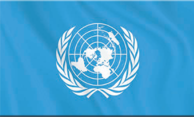
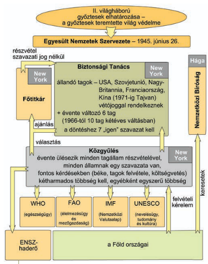

# Szovjet megszállás ("felszabadítás") Magyarországon  
- A szovjetek megszállták az országot (1944-1945)  
## Mi az a SZEB?  
- **Szövetséges Ellenőrző Bizottság**  
	- Szovjet irányítású  
	- Minden "szabadított" területen létrejött  
- A szuverinitást elvesztő államokban a hatalom az ő kezükbe került	  
- Jogai  
	- Pártok szabályozása  
	- Ellenőrizhette a pártok működését  
	- Állampolgárokat letartóztathattak  
	- Törvényeket eltörölni, elfogadtatni  
	- Miniszteri pozíciók kiosztása  
## Mivel biztosítják a kommunisták hatalmát?  
- A nemzetiszocialista és nyilasuradalmat felszámolták a SZEB segítségével  
- Eleinte demokratikusnak kinéző folyamattal, több éves program  
- Kihasználták az erőszakszervezeteket (rendőrség, belügyminisztérium) a politikai harcban  
## Milyen bűnöket követtek el a szovjetek?  
- Erőszak  
- Kényszermunka  
- Szólásszabadság korlátozása  
## Milyen veszteségei voltak a Magyarságnak?  
- 800-900 ezer magyar katona került fogságba, közel 2/3 szovjet táborokba  
- 150-200 ezer magyar katona elesett a frontokon  
- kb. 200 ezer civil halt meg bombázásokba és frontharcok  
## Mi az a Malenkij-robot  
- Kényszermunka  
- Többszáz ezer magyar állampolgárt hurcoltak el rá  
#  ENSZ  
- 1945 - Egyesült Nemzetek Szervezete (ENSZ) létrejött  
- Felépítésében a nagyhatalmak erőfölénye érvényesült  
- Kezdetben a vesztes államok nem voltak tagjai  
## Felépülése  
  
### Biztonsági tanács  
- Röviden BT  
- A lényeges kérdések itt dőlnek el  
- 7 igen szavazat kell  
- Öt állandó + 6 évente változó  
- Állandó tagok  
	- USA  
	- Szovjetunió  
	- Franciaország  
	- Nagy-Britannia  
	- Kína  
- Az állandó tagok vétójoggal rendelkeznek  
- Az állandó tagok összetétele egyszer változott  
	- 1949, Kína - Polgárháború  
	- Az eddigi vezetés Tajvanra szorult vissza  
	- 1971-ben felváltotta a Rendszerű Kínát a Kínai Köztársaság  
- A nem állandó tagok számát 1966-ban megemelték  
	- a Biztonsági Tanács tagjainak száma tizenötre emelkedett  
	- Nem jelentett lényegi változást a tanács múködésében  
## Védnökség alatti szakirányú szervezetek  
- Példák (tudni kell)  
	- UNESCO - Oktatás és kultúra  
	- FAO - Élelmezés és mezőgazdaság  
	- WHO - Egészségügy  
	- IMF - Nemzetközi valutaalap  
- Egyeztetnek a problémák megoldásában  
- Közbelépnek katasztrófáknál  
## Békefenntartók  
## Nemzetközi bíróság  
- Hága  
- ENSZ pereli az embereket itt  
	- Legtöbbször háborús bűncselekményeket, vagy emberi jogok megszegéséért  
## Közgyűlés  
- Évente ülésezik  
- Minden tagállam részt vesz  
- Minden államnak 1 szavazat  
	- Fontos kérdésekben 2/3os többség  
	- Egyébként egyszerű  
## Bretton Woods-i konferencia  
- 1944 nyara  
- 44 ország képviselésével  
- A világ döntő pénzügyeire ekkor döntő mértékben volt hatással az USA, ők irányították az eseményeket  
- A jövő világában a szabadkereskedelmet biztosították, és ennek pénzügyi alapjait meg kívánták teremteni  
- Az egyezmény aláírói vállalták, hogy  
	- Egyeztetik pénzügyi politikájuk  
	- valutájuk átváltási arányait az aranyhoz mérve rögzítik, csak kis mértékben térhetnek el (1%)  
- Közvetítő valutává vált a dollár  
- Létrehozták a nehézségek "áthidalására" a Nemzetközi Újjáépítési és Fejlesztési Bankot (Világbank) és Nemzeti Valutaalapot (IMF)  
# A Bipoláris (kétpólusú) világ kialakulása  
- WW2 után 2db szuperhatalom emelkedik ki  
## Szuperhatalmak létrejötte  
### Az Egyesült kiráyság  
- Gazdaságuk teljesen megrendült, eladósodott az USA felé  
- Latható volt, hogy a fegyverkezési kiadásokat nem lesz képes vállalni -> Egyesült királyság csak másodrendű nagyhatalom lett  
### Franciaország  
- Vichy vezetését elfelejtették  
- Győztesek közé tartozott, mivel így a szovjetuniót tudták ellensúlyozni a megszállt Németországban  
### USA  
- A többi állammal ellentétben ők tovább erősödtek  
- A háború fellendítette a gazdaságukat, megviselés helyett  
- A háború indította meg a gazdasági világválság utáni valódi fellendülést  
- Az atombomba birtoklásával egyértelműen a föld vezető nagyhatalma lett  
### Szovjetunió  
- Óriási veszteségek WW2-ben  
- A 12 milliós hadseregük miatt a második nagyhatalommá emelkedett  
- Ezennel kétpúlusú lett a világ  
	- Az USA és SzU kiemelkedett  
	- Csak ők tudták előteremteni békében is a hadseregfejlesztéshez szükséges összegeket  
	- A jövőben a két szuperhatalom állása döntött a jelentős kérdésekben  
# Churchill Fultoni beszéde (1946)  
- Nem volt eddigre Churchill hivatalban, szabadabban fogalmazhatott  
- Vázolta  
	- A folyamatos szovjet előretörést  
	- A köztes-európa szovjetizálását  
	- A szovjezek által megszállt országokat elzáró vasfüggöny kialakulását  
- Kijelentette, hogy amennyire lehet kerülni kell a háborút, ehhez fegyverkezni kell, mert a szovjeteket csak az elrettentő erő fogja megállítani  
- Sztálin nyíltan reagált  
- Sokan innen számítják a hidegháború kezdetét  
# Feltartóztatási politika  
- 1946 után felgyorsultak az események  
- 1947 - Truman megfogalmazta az USA külpolitika irányait és a feltartóztatási politika alapjait  
- A szovjetek 1947es előretöréseit tudomásul vették, de parancsolták a megállást, nem tűrtek el több területnyerést  
- Fokozták az USA katonai jelenlétét  
- Támogatták a polgári erőket a veszélyeztetett országokban  
- Fontos volt a szovjet behatolás által veszélyeztetett államokat támogatni, hogy visszaszorítsák a nyomort  
## Marshall terv  
- Fontos eleme volt a feltartóztatási politikának  
- Segélyprogram  
- A kommunista veszélyt felidéző nyugat-európai nyomort akarta felszámolni  
- Működőképessé kívánta tenni a térség gazdaságát  
- Biztosítani akarta az amerikai áruk piacát, az USA gazdaságának is fenntartását  
- Feltételekhez kötötték  
	- Az európai feleknek együtt kell működni, meg kell nyitniuk a piacukat egymás felé  
- A szovjetek ettől távol tartották magukat  
	- Nem voltak hajlandóak együttműködésre, az USA befolyás erősödését látta benne  
	- A szovjet befolyás alá került kelet-európai államokat is erre kényszerítette  
	- A Csehszlovákok eleinte elfogadták, de Sztálin nyomására visszahátráltak  
# Párizsi béke  
- A vesztes országok fegyverszüneti egyezményeikben elismerték a győztesek akaratát  
	- Erre példa: SZEB korlátozta a szuverinitást  
- Németországgal nem is kötöttek békét  
- A többi vesztessel (Bulgária, Finnország, Olaszország, Magyarország, Románia) 1947 februárjában, Párizsban megkötötték  
- A béke nem tartalmazta a Németországtól elcsatolt területek kérdését  
- A vesztes országoknak nagyrészt az 1937es határokat visszaállították  
	- Bulgária megtarthatta Dél-Dobrudzsát, de elvesztette Kelet-Trákiát (Görög terület lett)  
	- Románia visszakapta Erdélyt tőlünk, de elvesztette Besszarábiát  
	- Olaszország kénytelen volt átadni a dalmáciai területeit (Isztria, Spalato, Zára, Fiume) Jugoszláviának  
- Jóvátételi terheket megbeszélték  
## A Németkérdés  
- 10 millió német kitelepítése  
- Németországnak nem volt ilyenkor politikai szervezete (nácik kisajátították)  
- Németországot 4 megszállási övezetre osztották  
	- Szovjet  
	- Brit  
	- Amerikai  
	- Francia  
- Nem egyezett a felosztás a megszállások alatt tartott területekkel  
- Berlint kiemelték, azt is 4 részre osztották  
- Ausztria esetében ugyan ez történt  
# Berlini blokád  
- 1948 Június - 1949 Május  
- Mindenben hiányt szenvedtek a berliniek  
- Elzárták a forgalmat  
- A Nyugat Légi-hidat hozott létre az áruk szállítására  
# A 2 német állam  
- Két állam jött létre:  
	- NSZK  
		- Nyugat-Németország  
		- Német Szövetségi Köztársaság  
		- Demokrácia  
		- Konrad Adenauer  
			- Francia-Német békélést sürgetett  
			- Aláírta a Schuman tervet  
				- Francia-Német gazdasági együttműködés  
	- NDK  
		- Kelet-Németország  
		- Német Demokratikus Köztársaság  
		- Szovjetek által támogatott diktatórikus rendszer  
- NDK -> NSzK  
	- Berlinen keresztül  
	- A szovjetek ezt nem akarták -> Berlini fal megépítéséről döntöttek (1961)  
- 1949 Május  
# NATO  
- Észak-atlanti Szerződés Szervezete  
- Katonai Szervezet  
- 1949, San Francisco  
# Miért "Hideg" háború a megnevezés?  
- A szuperhatalmak között nem volt közvetlen háború  
# Feltartóztatási politika működésének bizonyítása  
## Koreai háború  
- Sztálin terjeszkedni akart  
- Sztálin állította, hogy közel álltak a WW3-hoz  
- A legközelebb a WW3hoz a Koreai konfliktus alatt voltak  
- A Japánok kiűzése után (1945) az Amerikai és Szovjet megszállást követően 2 korea jött létre:  
	- Kommunisták északon  
	- Kapitalisták délen  
- 1950 - Sztálin és Mao Ce-tung jóváhagyásával a felfegyverkezett északi kommunista hadsereg váratlanul megtámadta dél koreát, majdnem az egész országot elfoglalták  
- Az USA azonban kihasználta az ENSZ felhatalmazást, 1950 végén már a kínai határ végén folytak a harcok  
	- Sztálin kérésére a kínaiak "önkéntesekként" beléptek a harcokba, visszaszorították az ENSZ erőket  
- Végül nem volt béke, csak fegyverszünet (1953), ami ma is érvényben van  
## Vietnám  
- 1945, Vietnám  
- Vietnámban kommunista partizánok Ho Si Minh (felvett név, "felvilágosult") vezetésével kijelentették északon, Hanoiban a függetlenséget  
- A franciák nem ismerték el függetlenségüket, csapatokat küldtek a terület visszaszerzésére -> Indokínai háború kezdete  
- A francia lakosság nem akart se emberi, se anyagi veszteségeket  
	- A franciák csak amerikai pénzügyi támogatásokkal és fegyverszállításokkal bírták a harcot  
- 1954-es vereség után tárgyalóasztalhoz ültek a franciák  
- Genf, 1954  
	- Vietnámot ketté osztották  
		- Északi, Kommunista állam  
		- Déli, Kapitalista állam  
	- A kommunisták evvel nem értettek egyet, tovább folytatódtak a harcok  
- A kommunisták visszafoglalását a Szovjetek és kínaiak támogatták  
- Az USA a déli rész függetlenségéért küzdött, amit az észak nem akart  
- 1972 - Az Amerikai és észak-vietnámi küldöttség a dél-vietnámi küldöttség tudta nélkül megállapodott  
	- Az USA már eldöntötte 1968-ban, hogy kivonul a területről, a legkisebb presztízsvesztéssel ha lehet  
	- Kivonult az USA az 1973-ban harcoló erőivel az országból  
	- A Dél-Vietnám rezsimet továbbra is óriási katonai-anyagi támogatásban részesítette  
- Ennek ellenére dél-vietnám ereje megtört, az északiak a békeszerződést megszegve megtámadták dél-vietnámot, elfoglalták Saigont (később Ho Si Minh-város)  
- Egyesült a két ország 1976-ban Vietnámi Szocialista Köztársaság néven  
## Kubai rakétaválság  
- 1962, Kuba  
- Kubában forradalom  
	- nyomor és az amerikaiakat kiszolgáló diktatúra ellen felléptek  
	- Fidel Castro vezetésével  
	- Győztek (1959)  
- A szovjetek támogatták Castro rendszerét, az egyre inkább kommunista jelleget öltött  
- Az USA a kubai emigránsokat akarta használni a Castro rendszer megdöntésére  
	- A szovjetunió válaszul atomrakétákat telepített Kubába, 1962-ben  
	- Az USA válaszul blokád alá tette Kubát  
- A két vezetőnek kompromisszumot kellett kötni  
	- A szovjetek kivonták a rakétát kubából  
	- Az USA lemondott Kuba lerohanásáról  
- Ezután rövidesen leszerelte az USA a törökországi atomrakétáikat is  
- Létrejött a "forródrót"  
## Afganisztán  
- A szovjetek megindultak az Olajválság miatt a közel-kelet irányába  
- Az USA a afgán guerillákat támogatta  
- A szovjeteknek annyira sok erőforrásba került volna elfoglalni őket, hogy inkább feladták  
# Mi az a McCarthyzmus?  
- Az USA-ban megjelent az ellenségeskedés, McCarthy szenátor a kommunista és baloldali értelmiség ellen lépett fel  
- Az embereknek maguknak kellett bizonyítani az ártatlanságukat  
- A mccarthyzmus sok ember életét ellehetetlenítette  
- A polgári demokrácia vissza tudta szorítani  
# Mi az a Varsói szerződés?  
- 1955, Varsó  
- Az NSzK felvétele a NATOba Hruscsovot (Sztálin halála utáni **(1953)** szovjet vezető) egy szocialista NATO készítésére erőltette  
- A szovjetunió csatlós államait tartalmazó katonai tömb  
# Mi az a KGST?  
- Kölcsönös Gazdasági Segítség Tanácsa  
- 1949. Január 25., Moszkva  
- Tagjai  
	- Szovjetunió  
	- Bulgária  
	- Csehszlovákia  
	- Lengyelország  
	- Magyarország  
	- Románia  
	- Albánia (1949, 1961 Felfüggesztette tagságát, 1987 - Kiléptek)  
	- NDK (1950)  
	- Mongólia (1962)  
	- Kuba (1972)  
	- Vietnámi Demokratikus Köztársaság (1978)  
	- Jugoszlávia  
- Feladatul tűzte ki  
	- A szocialista országok közti gazdasági együttműködés erősítését  
	- A gyengébb tagállamok felzárkóztatást (Munkamegosztás, specializálódás)  
		- Magyarország - autóbuszok gyártására szakosodás  
			- Az Ikarusz így jutott mindenhova a szocialista világban  
		- Csehszlovákia - a Tatra villamosok gyártására szakosodás  
		- NDK - halfeldolgozó halászhajók  
		- Bulgária - Ipari Targoncákra szakosodás  
- Fennállása alatt magyarországon és csehszlovákiában volt a legnagyobb az egy főre jutó GDP  
# SALT-1  
- 1972  
- A szuperhatalmak maximalizálták a rakétafegyvereket  
# Olajválság  
- 1973-1974  
- Arab-Izraeli háborúk 1973-as Jóm Kippuri háborújában Izrael megvédte az általa megszállt területeket -> Az olajtermelésbe beavatkoztak, négyszeresére emelték az olaj árát  
# Helsinki értekezlet  
- 1975  
- Kimondták, hogy törekszenek  
	- A békés, egymás mellett élésről  
	- A határok sértetlenségéről  
	- Alapvető emberi jogokról  
# Kishidegháború  
- A szovjetunió növelni akarta befolyását  
	- Afganisztánt megszállták  
	- Viszont az afrikában történő események megakasztották az enyhülés, békülés időszakát  
	- A szovjetek olajforrások felé indultak meg az olajválság miatt  
- Az amerikaiak az afgán gerillákat támogatták  
- Végül annyira költséges lett az afgán megszállás, hogy 1988-ban kivonultak a szovjetek  
# Carter-doktrína  
- USA megmondta, hogy fegyverrel is megvédik az olajforrásokat  
# Szovjet válság  
- Az olajárrobbanás után új világ köszöntött be  
	- Az a hatalom kerekedett fel, amely technológiában képes alkalmazkodni  
	- Ehhez a szovjet rendszer nem volt alkalmas  
		- Egyre jobban adósodtak, hogy hatalmukat fenntartsák  
# Csillagháborús terv  
- Ronald Reagan idején indult  
- Világűrbe telepített átfogó rakétavédelmi rendszer  
- A szovjetuniót a gazdasági válságuk miatt ez felbillenéssel fenyegette  
# Peresztrojka  
- "Átalakítás"  
- Gorbacsov reformprogramja  
- Életminőség romlásának megakadályozása  
	- Akár a fegyverkezés visszafogása által  
- Új külpolitikai hozzáállást követelt  
	- Területekről mondtak le  
	- Fegyverkorlátozásokról állapodtak meg az USA-val  
# Glásznoszty  
- Belső politikai változások része volt  
- "Nyilvánosság"  
- Az eddig politikából kizárt embereknek ekkortól lehetett hangot adni az elégedettlenségről  
# Német egyesülés  
- 1990. Október 3.  
- A győztes hatalmaknak le kellett mondani minden megszálló jogukról (Sz.U.-nak is)  
# Szocialista tömb és szovjetunió összeesése  
- Gorbacsov nem avatkozott be a szétesésbe  
	- A balti államok ellen fegyveresen próbáltak fellépni  
	- A régi kommunista Szovjetuniót feltámasztani vágyók sikertelen katonai puccskísérlete után abba is maradt  
- 1991. December - Megszűnt a szovjetunió  
- Létrehozták a FÁK-ét  
	- Nem csatlakozott minden Szovjet tagállam  
# Kennedy végzete  
- Merénylet áldozata lett  
# Ki az a Martin Luther King  
- A feketék egyenlőségéért küzdő polgárjogi aktivista  
# Watergate botrány  
- Nixon elnök lehallgatási botránya  
- Sikertelenül megpróbálták eltusolni  
# Apartheid  
- Szegregációs politika 1994-ig Dél-Afrikában  
# Kommunista Magyarország  
## A SZEB szerepe  
- Engedélyezték az ellenzéki pártok működését  
	- FKgP (Független Kisgazda Párt)  
	- NPP (Nemzeti Parasztpárt)  
	- SzDP (Szociáldemokrata Párt)  
	- PDP (Polgári Demokrata Párt)  
	- MKP (Magyar Kommunista Párt)  
		- Rákosi Mátyás  
		- Nagy Imre  
		- Gerő Ernő  
		- Révai József  
## 1945ös választások  
- Minden 20 év feletti férfi és nő szavazhatott  
	- Kivéve háborús bűnösök  
- Pártlistás szavazás volt, nem egyéni  
- az FKgP volt a legnagyobb ellenzék  
- 57.03%-os FKgP nyereség  
	- Egyértelmű többség  
	- Viszont a SZEB beavatkozott  
		- A Kormányt kényszeríti, hogy kommunistákat rakjanak a pártba (Belügy)  
## Mi az, hogy Szalámi taktika?  
- Kikiáltották, hogy M.O. köztársaság legyen (1946. Február 1.)  
- Az államformától eltekintve minden kérdésben harc volt az FKgP és MKP között  
- A kommunisták még több hatalomhoz akartak jutni  
	- Felhasználták a tömegeket, a demagógia és megfélemlítés eszközeit  
	- Kis lépésekben történő térnyerés  
	- Kihasználták a Vörös Hadsereg által biztosított erőfölényt  
		- Visszaszorították a számukra veszélyes csoportokat a rivális pártokról, "felszeletelve" őket (Szalámitaktika)  
		- A pártokon belül kommunista baloldali csoportok létrehozásán ügyködtek, hogy megosszák e a pártokat  
## Kommunista agitáció, a "Földet vissza nem adunk" rígmus  
- Volt Földosztás, elvették a kisebb területeket is  
	- az FKgP szót emelt róla  
	- MKP: "A kisgazdák veszik el az emberektől a földet"  
	- Nép be like: "GRRRRR"  
## Baloldali blokk  
- az MKP kezdeményezte a baloldali blokk megalakítását  
	- Résztvevők  
		- MKP  
		- SzDP  
		- NPP  
	- 1946 Március  
	- Támadást indítottak a kisgazdák ellen  
		- A párt polgári vonalát jobboldalinak minősítették (A korszakban a demokrácia tagadása)  
