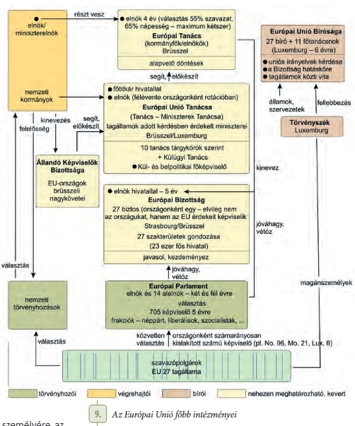

# Muszlim fundamentalizmus  
- Legjelentősebb terrorista akció: 9/11  
- Terrorizmus  
	- Fogalom a Francia forradalomból  
	- "Terror" latin szóból  
- Arab Tavasz  
	- 2011  
	- Rengeteg arab diktátor elbukott  
	- Polgárháborúk  
- Globalizáció  
	- "A világ egyes részei közötti teljes összefonódás"  
	- Világszerti kapcsolati háló  
- Multinacionális cégek  
	- Nemzetközi tulajdonosi háttér  
	- Pl. Amazon  
# M.O. a 21. században  
- Parlamenti Váltógazdálkodás  
- Kettős állampolgárság: Határon kívüli magyaroknak megadja a lehetőséget, hogy szavazzanak itthoni problémákban  
- M.O. NATO-ba:  
	- 1999\. Március 12.  
	- Észak Atlanti Katonai Szövetség  
- Sorkatonaság megszűnése: 2004  
- 1991 - Visegrádi együttműködés  
# Európai Unió  
- **Integrációs folyamat** eredménye  
## Előzményei  
- A 2.VH után jelent meg  
- Alapvető okai  
	- Európa kettéosztottsága  
	- Európai államok félelme a szovjet előretöréstől  
- Az európai együttműködés az 1940-es évek végétől indult meg  
	- Politikai  
	- Gazdasági  
### Marshall-terv  
- 1947  
- Gazdasági helyreállításának lehetősége  
- Feltételezte a nemrég harcban álló népek közti politikai békét, elősegítette ezt a németek megosztottsága, gazdasági meggyengülése  
### Európai Szén- és Acélközösség  
- 1951  
- Más néven **"Montánunió"**  
- Célja a szén és acél közös piacának megalapítása  
- Hat tagország  
	- NSzK  
	- Franciaország  
	- Olaszország  
	- Benelux államok  
		- Belgium  
		- Hollandia  
		- Luxemburg  
- 1957 - Római szerződés  
	- Francia-Német megbékélés adta az alapját  
	- A Montánunió résztvételével létrejött az Európai Gazdasági Közösség (EGK)  
	- Más néven a Közös piac  
	- Vámok kölcsönös leépítése  
	- Személyek, szolgáltatások és tőke szabad mozgásának biztosítása  
### A szovjetunió összeomlása  
- A kommunizmus alól felszabaduló országok stabilitást és fejlődést remélve csatlakozni akartak  
- Összeomlása és a német egyesülés (1990) változást hozott  
	- Megerősödtek a szorosabb gazdasági és politikai integráció támogatói  
	- 1992 - Maastrichti szerződés  
		- Létrejött az Európai Unió  
			- Szorosabb gazdasági és pénzügyi unió megteremtése  
			- Összehangolt európai kül- és biztonságpolitika  
			- Döntöttek a(z)  
				- Uniós állampolgárság bevezetéséről  
				- Európai Parlament jogkörények növeléséről  
## Schengeni egyezmény  
- 1995-től  
- EGK alapítói írták alá  
- Megszűntetik a határellenőrzést  
	- Külső határaikon szigorítják  
- Csak közös szabályok által engedélyezett személyeket bocsátanak be a schengeni övezetbe  
- Az unió új tagjai és csatlakoztak hozzá  
- Manapság 29 ország tagja  
## Európai Monetáris Rendszer  
- 1979  
- Maastrichti szerződésben megállapodtak egy közös európai valuta létrehozásáról  
	- 2002\. Január 1.  
	- 12 EUs országban megjelent eleinte  
## Nizzai szerződés  
- 2001  
- Korábbi konszenzusos döntéshozatali rendszert többségi elvvel váltották fel  
- Rögzítették az unión belüli országok súlyát a döntések meghozatalában (szavazati arányok)  
## Lisszaboni szerződés  
- 2007  
- Az EU működését megváltoztatja  
## Intézményi Rendszer  
- Bonyolult  
- Itt egy kép róla  
  
### Az Európai Tanács  
- A legfontosabb kérdésekben és főbb irányelvekben ők döntenek  
- A Nizzai szerződés után Brüsszelben ülésezik  
- A Lisszaboni szerződés alapján főállású, négy évre megválasztható elnököt választ  
	- Nem lehet újraválasztani  
- Az elnök vezeti  
	- 4 évre választják  
	- Nem lehet újraválasztani  
### Európai Unió Tanácsa  
- Az Európai Uniót érintő döntéseket ők hozzák  
- A tagországok szakminiszterei alkotják  
- Többségi szavazás  
- Ülésein mindig azok a miniszterek vesznek részt, akiknek a hatáskörébe tartozik a téma  
- Munkáját segíti az Állandó Képviselők Bizottsága (COREPER)  
	- A tagországok brüsszeli nagyköveteiből áll  
- Brüsszel/Luxemburg  
- Az elnök vezeti  
	- Félévente országonként rotációban  
### Európai Parlament  
- Nem törvényalkotók  
- Véleményezi a tervezett jogszabályokat  
- Ellenőrzi azok végrehajtását  
- Eljárásokat kezdeményezhet  
- Fontos szerepe van az Unió költségvetésének elfogadásában  
- Képviselőit a tagországok közvetlenül választják meg 5 évre  
- Meghatározott számú képviselőt küldhetnek a tagállamok  
	- Lakosságszám figyelembevételével határozzák meg a számot  
	- Kisebb államok számarányuknál több mandátummal rendelkeznek  
- A képviselők pártonként alkotnak csoportokat (frakciókat)  
	- A legnagyobb a néppárti és szocialista-szociáldemokrata frakció  
### Európai Bizottság  
- Jogszabályok, döntések végrehajtása  
- Javasolhat jogszabályokat  
- Minden tagország egy tagot, "biztost" küld, akinek a feladatát a Bizottság elnöke határozza meg, pl.  
	- Adó- és Vámügy  
	- Munkaügy  
	- Energiaügy  
	- Oktatás  
	- Kultúra  
	- Sport  
- Az elnökére az Európai Tanács tesz javaslatot, az Európai Parlament választja meg  
## Tagállamok  
- Alapító tagok (1957)  
	- NSzK (Németország)  
	- Franciaország  
	- Olaszország  
	- Belgium  
	- Hollandia  
	- Luxemburg  
- EGK  
	- Dánia (1973)  
	- Írország (1973)  
	- Egyesült Királyság (1973)  
		- Brexit miatt kiléptek  
	- Görögország (1981)  
	- Portugália (1986)  
	- Spanyolország (1986)  
	- Németország (1990)  
	- Svédország (1995)  
	- Finnország (1999)  
	- Ausztria (1999)  
- EU  
	- Észtország (2004)  
	- Lettország (2004)  
	- Litvánia (2004)  
	- Lengyelország (2004)  
	- Szlovákia (2009)  
	- Csehország (2004)  
	- **Magyarország (2004)**  
	- Szlovénia (2004)  
	- Románia (2007)  
	- Bulgária (2007)  
	- Málta (?)  
	- Ciprus (2007)  
	- Horvátország (2013)  
## Magyarország az EU-ban  
- Csatlakozás  
	- 1994-ben beadtuk a csatlakozási kérelmet  
	- Csatlakozásról tartott népszavazás  
		- A szavazásra jogosultak közül csak 45.62% jelent meg  
		- 83.76% Igennel szavazott  
	- 2004-ben be lettünk fogadva  
- M.O. megnyitotta piacait az Unió előtt  
	- A nyugati országok szinte versenytárs nélkül tudtak teret hódítani  
- Feszültséget okoz az Unióban, hogy egyes tagországok (pl. mi vagy Lengyelország) számos kérdésben más politikai válaszokat adtak  
	- Pl. a Migráció kérdésében M.O. betartva a Schengeni határokra vonatkozó szabályokat gátat szabott az illegális bevándorlásnak (2015)  
