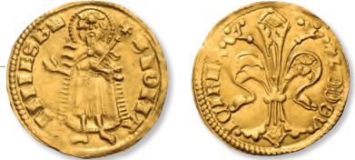

"Milyen reformokat hajtott végre I.Károly a monarchia gazdasági felemelkedése érdekében"  
# Károly Róbert  
- 1301-1321  
- Magyar királyság  
- Kihalt az Árpád-ház férfi ága  
## Trónöröklés  
- Nem volt az Árpád-háznak férfi örököse, így ideiglenesen interregnum volt 1301-től 1308-ig  
	- A hatalom a kiskirályok kezébe került  
	- A király minden hatalmat elvesztett, csak a tartományurak jóindulatának elnyerése után számíthatott a trónra  
	- A trónért az Árpád-házzal lányágon rokon dinasztiák küzdtek a hatalomért  
- 1301-ben megkoronázták hívei Esztergomban, egy alkalmi koronával  
	- A tartományurak ezt nem fogadták el, arra hivatkoztak, hogy nem a Szent koronával koronázták meg  
	- A pápa és horvát nemesek támogatták  
- 1308-ra a legtöbb tartományúr elfogadta Károly Róbertet királyának  
- 1309-ben újra koronázták, de szabálytalan volt  
	- A Szent korona még Kán Lászlónál volt  
- 1310-ben hivatalosan is megkoronázták  
## Belpolitika  
- 1312-ben a Rozgonyi csatában legyőzte a kassai polgárokkal vitába került Abákat  
- Egyes kiskirályokkal kibékült, másokat fegyverrel győzött le, de volt akivel haláláig nem tudott leszámolni (1321, Csák Máté)  
- 1315-től a legfontosabb méltóságait a Károly Róberthez hű nemesek kapták meg, belőlük jött létre az új bárói réteg  
### Gazdasági reformjai  
#### Bányareform  
- Bevezette az urburát, avagy bányabért  
	- A kitermelt nemesfém egy része a királyé volt  
	- A földesurak részesedést kaptak -> érdekeltté váltak a bányanyitásban  
#### Aranyforint  
  
- Stabil, értékálló aranyforintot bevezette  
- Mintája a firenzei aranypénz volt  
- Előnyök  
	- Megbízható pénz jött létre  
	- Fellendítette a gazdaságot  
	- Növelte az ország nemzetközi gazdasági szerepét  
- Megszűntette a pénzváltásból való jövedelmet, így a kapuadót is bevezették  
#### Kapuadó  
- Bevezette a kapuadót  
	- Minden jobbágyporta után kellett fizetni  
- Igazságosabb, kiszámíthatóbb adó volt  
- Stabil királyi bevétel lett  
#### Regálék megerősítése  
- A királyi jövedelmek nagy része regálékból származott  
	- Pénzverés  
	- Bányászat  
	- Sómonopólium  
- Ezeket közvetlen királyi ellenőrzés alá vonta, nőtt az állami bevétel  
#### Harmincadvám  
- Harmincadvámot bevezette  
	- Az áru értékének egy harmincadát vámként ki kell fizetni  
- Támogatta a városok fejlődését  
### Új várostípusok  
- Szabad királyi városok  
	- Nagy önállósággal rendelkeztek  
- Bányavárosok  
- Mezővárosok  
	- Földesúri fennhatóság alatt állnak  
	- Korlátozott önállóság  
	- Egyösszegű adófizetés  

# Források  
- [erettsegi.com](https://erettsegi.com/tetelek/tortenelem/karoly-robert-gazdasagpolitikajanak-fobb-elemei/)  
- [erettsegi.com](https://erettsegi.com/tetelek/tortenelem/karoly-robert-gazdasagpolitikaja/)  
- [Csetdzsipiti](https://chatgpt.com/share/69ba5c99-6dd4-8013-8590-d4ab8fd8401b)  
- [9-es történelem tankönyv](https://www.tankonyvkatalogus.hu/tankonyv/OH-TOR09TB)  
